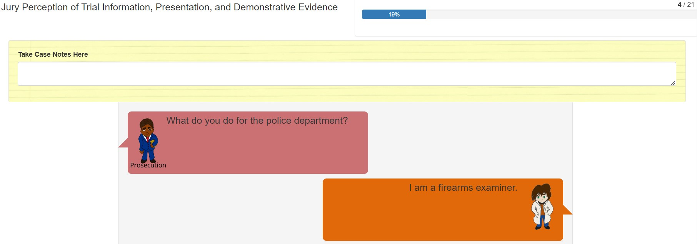
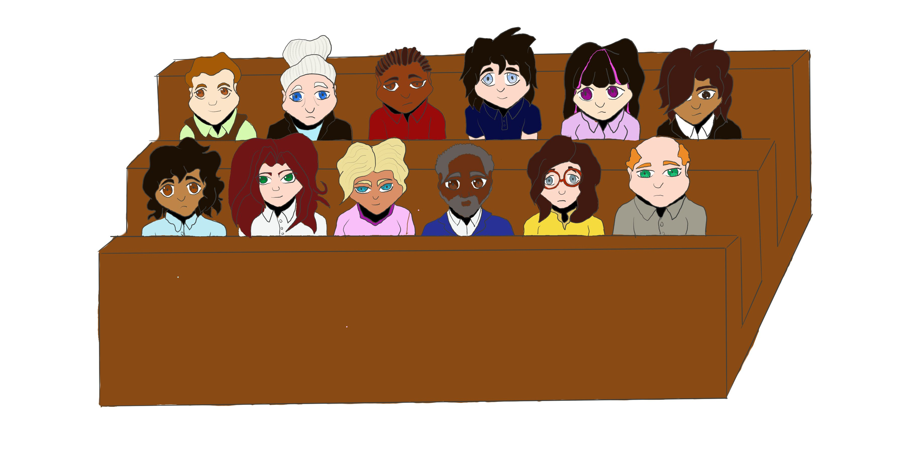
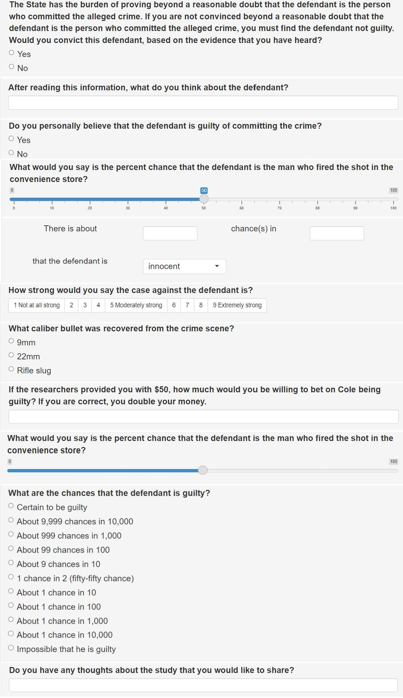

# An Investigation of Response Types {#study2}

## Background


### Problems in Study 1

The results from the initial study found in Chapter \@ref(study1) call into question the use of Likert response scales when evaluating jury perception of firearms experts, as well as the use of a transcript testimony format.
Responses pertaining to the credibility of the expert, as well as the reliability and scientificity of the evidence, suffered from scale compression when a Likert scale was used - participants indicated overall confidence in credibility, reliability, and scientificity by mainly selecting the two highest categories of each scale.
This lack of variation in scale responses makes it difficult to discern potential differences between treatment conditions.
Due to this difficulty, we conducted a follow-up study comparing various response types, in order to determine substitute questions that may result in a wider distribution of responses. \svp{I think you may want to have a few references about why scale compression is bad and how to deal with it as part of the intro here?}

\authorcol{According to }@grovesSurveyMethodology2009\authorcol{, an error in survey measurements may result from a difference between the construct that we wish to evaluate, and the measurement used to evaluate it.
In this case, there is a disconnect between what we want to measure (participant's perception of the witness/method's abilities) and what we ended up measuring with Likert scales (reliability, credibility, and scientificity).
This disconnect can be seen in the form of scale compression: due to the limited scale, we are unable to observe individuals' true perceptions with regards to the witnesses and methods.}
@grovesSurveyMethodology2009 \authorcol{ uses the National Assessment of Educational Progress as an example of the difference between construct and measures: "when measuring the construct of mathematical abilities of 4th graders, the measures are sets of arithmetic problems" (50).
The scale compression seen in our initial study would be equivalent to using the wrong set of arithmetic problems: if the problems are simple enough that almost all 4th graders receive a perfect score, then the true mathematical abilities of the 4th graders are not being evaluated.
Similarly, the standard for being considered reliable, credible, and scientific as a court-approved witness or method is too easy to overcome.}

In investigating  scale compression, we found that @OpinionEvidence suggests that the use of the term "expert" may result in jurors giving the testimony more weight, and \authorcol{suggests judges use the following jury instruction:}

>\authorcol{"You [have heard] [are about to hear] testimony from [name] who [testified] [will testify] about [his] [her] opinions and the reasons for those opinions.  This opinion testimony is allowed because of the specialized knowledge, skill, experience, training, or education of this witness.
Such opinion testimony should be judged like any other testimony.  You may accept it or reject it, and give it as much weight as you think it deserves, considering the witness’s knowledge, skill, experience, training, or education, the reasons given for the opinion, and all the other evidence in the case."}

Additional cross examination testimony with regards to the firearms examiner's inability to specifically tie the defendant to the crime scene is included as well, due to a lack of distinction in participants between evidence tying the firearm to the crime scene, and evidence tying the defendant to the crime scene.
As in the initial study, these changes were directly related to trial transcripts or resources.
The transcript changes for the second study can be found in Appendix \@ref(study-2-changes).

In the initial study, some participants were confused about \authorcol{the witness testimony}, as evidenced by their written comments:

>\authorcol{"I don't know that much about court stuff, but why would the prosucution bring the firearms expert when he didn't think the defendant's gun fired the shot? I was confused about that."}

>\authorcol{"I'm not sure why the prosecution would have even called that witness because they basically said there was no conclusive bullet evidence"}

>\authorcol{"Very difficult for juror to understand and remember the scientific evidence."}

\authorcol{Other participants thought that the defendant was convicted, although this is not specified in the transcript:}

>\authorcol{"Going by what I read and reviewing my notes I see that the firearms evidence was inconclusive against R. Cole.}  *So I am baffled as to why he was convicted.* \authorcol{[emphasis added] Also I prefer more things like visual evidence via a good quality video camera. Or a whole group of people testifying against someone saying things like they saw, they heard, or they know someone is prone to commit certain crimes."}

>\authorcol{"I would have like another firearms expert testify or a representative from that 9mm handgun manufacturer explain how and why each individual handgun are designed such that the lands and grooves create unique impressions on bullets for each gun. I do believe the firearms expert and his credibility.} *Further, the defendant would be basically convicted only on one evidence.* \authorcol{[emphasis added] Would have liked to read or know what was his alibi during that attempted robbery and if a search warrant issued to search for that ski mask. What about security cameras to determine any other physical identification. This case presentation was scant and focused too heavily on one piece of evidence and testimony."}

The testimony transcript format did not clearly identify the speaker with each line, instead using "Q:" and "A:" in most cases, as shown in Appendix \@ref(study-2-changes).
The lack of visual cues for \svp{matching text with the speaker} is not representative of the courtroom setting.
The transcript format may also lend an air of impartiality to the witnesses due to the relatively unclear identity of the individual asking the questions.
\authorcol{In order to clarify, we also added} testimony where the prosecution called the witness to testify, instead beginning with the swearing in of the witness.
Due to this issue, we strove to develop a general tool that can be used in online courtroom studies to provide visual representation of relevant actors, making it easier to track speakers, and with versatility in terms of individual characteristics.
\authorcol{These changes are shown in Figure} \@ref(fig:testimonyformat).

```{r}
#| testimonyformat,
#| fig.cap= "A screenshot of the layout of the second study.",
#| fig.width= 7,
#| fig.align= "center",
#| echo= FALSE,
#| message= FALSE,
#| warning= FALSE

library(knitr)


```

In order to minimize the chance of confounding typos as seen in Study 1, we used one master file with all lines of testimony, labelled by the scenario in which the testimony occurs, \svp{which minimizes the need to change testimony in multiple locations}.
\svp{In addition,} this format allows for more flexibility when implementing the R Shiny application.
We also use unique identification throughout the database files in the form of Prolific ID's and a random number assigned to the participant \svp{upon initial connection to the application} instead of relying on \svp{browser-based} fingerprints, which resulted in technical difficulties in a preliminary run of this second study, so the demographics section can more easily be linked to the final results.

\authorcol{Individuals also indicated confusion with regards to the use of a partial testimony transcript:}

>\authorcol{"Thank you for conducting this study. Where's the defense in all of this? It would have been  helpful to know whether or not the defendant had an alibi, whether his firearm had in fact been recently fired, from a forensics perspective, whether there were any in-store or exterior or neighborhood cameras that picked up whoever discharged the firearm. Convenience stores nearly always have a height chart posted alongside the door but no one provided an approximate height or weight for the person who discharged the firearm. This was an interesting study. All the best to your research team in this and  your future endeavors. "}

>\authorcol{“It would be interesting to know if the prosecution would order a second
testing of the gun with a different expert. Also why would the prosecution
charge this man since it had no eyewitnesses or other evidence placing him at
the scene of the robbery at the time of the robbery and since the gun found in
the defendant was not a match to the bullet found at the scene. Charging him
seems pointless as there’s virtually no evidence other than he owned a 9mm
handgun.”}

\authorcol{Due to this confusion, an additional line is added to the study description to clarify that this is not the only evidence presented in the case.}

### Study Visualization

```{r}
#| jurypanel,
#| fig.cap= "An image of the jury panel",
#| fig.width= 7,
#| fig.align= "center",
#| echo= FALSE,
#| message= FALSE,
#| warning= FALSE



```

Figure \@ref(fig:jurypanel) and Figure \@ref(fig:testimonyformat) show some of the characters that have been developed for this study (drawn by Richy Meleus), as well as a screenshot of the study format.
These characters were drawn so that the clothes and heads can be interchanged, providing a wide variety of characters for potential scenarios.
One difficulty in including drawn figures with realistic skin tones and figures is the influence of perceived race or gender on participant judgments.
@ImplicitRaceAttitudes found a relationship between implicit racial bias and the perceived trustworthiness of individuals based on images of black and white males.
They also found that 80% of participants exhibited pro-white implicit bias.
Because of this potential bias introduced by visual figures, we plan to conduct a follow-up study in order to determine how these figures are perceived \svp{as part of the validation of this set of figures for wider use}.
For the current study, the same figures are used consistently across all conditions to prevent a confounding effect.

To investigate a which response type may be most informative for this study and to troubleshoot the use of figures and speech bubble format, we conducted a micro study using various response types. 
\authorcol{As discussed in the Literature Review in Chapter} \@ref(litreview)\authorcol{, there are many issues with recording participant responses in a manner that best represents the construct of interest.
While the question we followed in Chapter} \@ref(study1) \authorcol{mainly aligns with the recommendations of these authors, in terms of the use of 7 and 9-point Likert scales with labelled categories, these scales failed to capture the underlying attitudes that we wished to address.
Based on these recommendations, adding more categories to the Likert scales would not be recommended, leading us to search for other methods of response.
However, participants may find the use of numerical scales to be difficult to use, so these scales must be investigated for consistency.}

## Methods

### Study Format

Participants were presented with the same scenario described in Chapter \@ref(study1): participants read a trial transcript regarding an attempted convenience store robbery, where the only evidence presented is a bullet comparison between the defendant's gun and a bullet recovered from the scene of the crime (a scenario from @garrettMockJurorsEvaluation2020).
In this case, however, the only factor that was changed was the conclusion of the firearms examiner: either an indentification or exclusion.
In all conditions, the algorithm was absent and there were no images \svp{provided as demonstrative evidence during testimony}.
The testimony largely followed that of Chapter \@ref(study1), aside from differences in the format and additional testimony described above and outlined in Appendix \@ref(study-2-changes).
In this case, it was also explicitly stated that the testimony did not reflect all evidence presented in the case, because in the exclusion condition there \svp{is clearly insufficient} evidence to bring the case to trial.
Figure \@ref(fig:responsefigures) depicts the characters used in this study. 
Those speaking on behalf of the prosecution were coded with speech bubbles in warmer colors (red for the prosecutor and orange for the forensic scientist), while the defense was coded with a cooler color (purple), and the judge was coded as grey.

```{r}
#| responsefigures,
#| fig.cap= "Figures used in the response study. From left to right: the judge, forensic scientist, prosecutor, and defense lawyer.",
#| fig.width= 7,
#| fig.align= "center",
#| echo= FALSE,
#| message= FALSE,
#| warning= FALSE

library(gridExtra)
library(grid)
library(jpeg)

judge <- readJPEG("images/Judge.jpg")

forensic_science <- readJPEG("images/Forensic Scientist.jpg")

lawyer <- readJPEG("images/Lawyer.jpg")

analyst <- readJPEG("images/Analyst.jpg")

grid.arrange(rasterGrob(judge),rasterGrob(forensic_science),
             rasterGrob(lawyer),rasterGrob(analyst),nrow=1, ncol=4)
```

At the end of the testimony, the participants were asked a variety of questions regarding the strength of evidence in the case.
\authorcol{All questions asked in this study are shown in Figure} \@ref(fig:questions).
Questions of probability, strength of evidence, and decision to convict were repeated from the Chapter \@ref(study1) study.
Participants were asked to evaluate the probability that the defendant committed the crime, both with a visible probability scale (allowing the participants to select the exact probability integer) and with a non-visible scale (only the numbers of 0 and 100 were available on the extremes of the scale).
The strength of evidence was a Likert scale with values from "Not at all strong" to "Extremely strong" with nine points.
In terms of conviction, participants were reminded of the decision criterion of "beyond a reasonable doubt" when making a decision in a criminal trial, and asked if they would choose to convict. 

```{r}
#| questions,
#| fig.cap= "Questions asked in the Response Survey",
#| fig.width= 7,
#| fig.align= "center",
#| echo= FALSE,
#| message= FALSE,
#| warning= FALSE



```

New questions for this response study asked individuals to give their opinion of the guilt of the defendant, as well as assessing the chances that the defendant committed the crime, how much they would be willing to bet that the defendant was either innocent or guilty, and their opinion of the defendant.
In addition to a question regarding whether or not the participant would choose to convict, we also asked the participants to give their personal opinion on the guilt of the defendant.
This provides a second threshold for assessing the strength of evidence, aside from the "beyond a reasonable doubt" standard.

Two different questions were asked with regards to the chances that the defendant committed the crime. 
One was in a multiple choice format, with extreme values of "Impossible to be guilty" and "Certain to be guilty", and intermediate values ranging from "About 1 chance in 10,000" to "About 9,999 chances in 10,000" with denominator values changing by a decimal place for each choice, and a middle value of "1 chance in 2".
This format was taken from @thompsonLayUnderstanding's study of DNA, which consisted of larger scaled values in the denominator (up to 1 in 10 million).
The second question allowed participants to select both the numerator and denominator: "About ___ chance(s) in ___ that the defendant is (innocent/guilty)", where participants were able to select to express the value as innocence or guilt (the default value was "innocent").
In the preliminary study, participants had to express chances that corresponded with their opinion on the defendant committing the crime, but this resulted in some scale confusion.
In both cases, the numerator had to be less than or equal to the denominator, \svp{restricting the numerical result to the $[0,1]$ range.}

Individuals who thought that the defendant was guilty were asked how much they were willing to bet that the defendant was guilty, if hypothetically researchers provided them with \$50 and they would double their money if they were correct, and vice versa.
A final new question was open ended, and asked participants to provide their opinion of the defendant.
We first asked individuals to provide their opinion of the defendant, their conviction decision, and their personal opinion of the guilt of the defendant.
All other questions were randomized \svp{subject to the constraint that} the two probability questions and the two chance questions were not \svp{adjacent}.


### Prolific

```{r echo=FALSE, warning=FALSE, message=FALSE}
library(readr)
library(scales)
library(ggridges)
microstudy <- read_csv("data/mircrostudy_response_redo_clean.csv")

# Removing record with unusually low completion time

microstudy_complete <- 
  microstudy[complete.cases(microstudy[ , c("convict", "guilt_opinion", 
                                            "betting", "hidden_probability",
                                            "chances_fixed", 
                                            "evidence_strength",      
                                            "numeric_chance", 
                                            "check", "visible_probability")]), ] %>% dplyr::filter(round(randomnumber,5) != 12.59938)

microstudy_clean <- microstudy_complete %>% 
  dplyr::filter(check=="9mm", round(randomnumber,5) != 12.59938)

prolific_data <- read_csv("data/microstudy_redo_prolific_clean.csv")

approved_prolific <- prolific_data %>% dplyr::filter(Status == "APPROVED")

```

Participants were recruited in a similar manner as Study 1 in terms of the representative sample and self-screened jury requirements through Prolific.
Participants were paid \$4.07 with a median completion time of 15 minutes and 15 seconds according to Prolific, for an average reward of \$16.01 per hour.
There were 300 paid participants who completed the survey, 22 individuals who decided to not complete the survey ("returned"), and 8 participants who did not complete the survey before Prolific's cutoff time ("Timed-out").
Figure \@ref(fig:completiontime2) shows the time spent on the survey, according to Prolific.
One individual took `r round(min(approved_prolific$'Time taken'/60), 2)` minutes to complete the survey, which is an unusually short amount of time (the next smallest time was `r round(head(sort(approved_prolific$'Time taken'/60))[2], 2)` minutes).
While this completion time is within three standard deviations of the mean (mean = `r round(mean(approved_prolific$'Time taken'/60), 2)`, sd = `r round(sd(approved_prolific$'Time taken'/60), 2)`) and does not fall within Prolific's criterion for rejection, we do not feel that this participant would have had adequate time to appropriately complete the survey, and have removed them from analysis.


```{r}
#| completiontime2,
#| fig.cap= "Prolific Completion Time",
#| fig.width= 10,
#| fig.height= 4,
#| fig.align= "center",
#| echo= FALSE,
#| eval= TRUE,
#| warning= FALSE,
#| message= FALSE

ggplot(subset(prolific_data, Status=="APPROVED"), aes(x = `Time taken`/60)) +
    geom_histogram(alpha=0.75) +
  ggtitle("Completion Time") +
  xlab("Completion Time in Minutes")+
  ylab("Count")+
  theme_bw()


```

## Results

### Participants

```{r}
#| demographics2,
#| fig.cap= "Demographic Information",
#| fig.width= 10,
#| fig.height= 4,
#| fig.align= "center",
#| echo= FALSE,
#| eval= TRUE,
#| warning= FALSE,
#| message= FALSE

microstudy_complete$age = factor(
  microstudy_complete$age,
  levels = c(
    "18 - 25",
    "26 - 35",
    "36 - 45",
    "46 - 55",
    "56 - 65",
    "Over 65"
  )
)
microstudy_complete$gender = factor(microstudy_complete$gender,
                           levels=c("Other/non-binary", "Man", "Woman"))
# table(microstudy_complete$age)

  ggplot(microstudy_complete,
         aes(x = age, fill = gender)) +
  geom_bar(mapping = aes(y = after_stat(count), group = gender), color="black") +
  #  geom_histogram(stat="count", position="dodge")+
  ggtitle("Age and Gender of Participants") +
  scale_fill_manual(values = c("#E69F00", "#009E73", "#F0E442")) +
  theme_bw()+
  xlab("Age")+
    ylab("Count")

```

Of the `r dim(microstudy_complete)[1]` surveys completed, `r sum(microstudy_complete$gender=="Man")` participants were men, `r sum(microstudy_complete$gender=="Woman")` participants were women, and `r sum(microstudy_complete$gender=="Other/non-binary")` participants identified as other or non-binary. 
The median age category was 46 - 55.
Age and gender are shown in Figure \@ref(fig:demographics2).
Individuals were asked a single attention check question with regards to the caliber of gun used in the attempted robbery.
`r dim(microstudy_clean)[1]` participants passed the attention check, meaning that only `r sum(microstudy_complete$check!="9mm")` participants failed the attention check, and will not be included in the analysis.
There were `r sum(microstudy_clean$conclusion=="Match")` participants in the identification condition and `r sum(microstudy_clean$conclusion=="NoMatch")` participants in the elimination condition who passed the attention check.
We adjusted the probability of receiving each condition throughout the survey to ensure \svp{the number of participants across} categories \svp{was} relatively equal.

### Questions from Study 1

```{r echo=FALSE, warning=FALSE, message=FALSE}
merged_results_allresponses<-read_csv("data/study1_merged_results_clean.csv")

merged_results_allresponses <-merged_results_allresponses %>% subset(clean_prints!=231)

merged_results <- merged_results_allresponses %>% filter(check1 =="9mm" & check2 == "Moderately reliable")

match_convict_compare <- prop.test(x=c(sum(microstudy_clean$convict=="Yes" & microstudy_clean$conclusion=="Match"),sum(merged_results$guilty=="Yes" & merged_results$conclusion=="Match" & merged_results$algorithm=="No" & merged_results$picture=="No")), n=c(sum(microstudy_clean$conclusion=="Match"), sum(merged_results$conclusion=="Match" & merged_results$algorithm=="No" & merged_results$picture=="No")),alternative="two.sided")
```

There were some procedural changes made to this study compared to the original study that may influence results: namely, more detailed cross examination and the inclusion of jury instructions.
\svp{These changes were made in order to reduce scale compression by providing a stronger defense and emphasizing the role of the expert witness as providing opinions.}
Another significant difference between the two studies is the time that has passed between the two studies.
The first study was conducted in July 2022, while this study was conducted in January 2024.
In this time, notoriety of firearms evidence has not remained the same - in this response study, a participant commented that they had recently read an article about the unreliability of firearms evidence.
\svp{This is in part due to a number of high-profile court cases in jurisdictions around the country which have limited the presentation of firearms evidence or how expert witnesses may present evidence to ensure that witnesses do not overstate the scientific value of firearms comparisons.}
More widespread criticism of firearms examination may lead to lower feelings of reliability.

In both studies, participants are asked if they would choose to convict, given the "beyond a reasonable doubt" threshold.
In this study, `r round(sum(microstudy_clean$convict=="Yes" & microstudy_clean$conclusion=="Match")/sum(microstudy_clean$conclusion=="Match")*100, 2)`\% (or `r sum(microstudy_clean$convict=="Yes" & microstudy_clean$conclusion=="Match")` out of `r sum(microstudy_clean$conclusion=="Match")`) individuals who received the identification condition chose to convict, while `r round(sum(microstudy_clean$convict=="Yes" & microstudy_clean$conclusion=="NoMatch")/sum(microstudy_clean$conclusion=="NoMatch")*100, 2)`\% (or `r sum(microstudy_clean$convict=="Yes" & microstudy_clean$conclusion=="NoMatch")` out of `r sum(microstudy_clean$conclusion=="NoMatch")`) participants who received the elimination condition chose to convict.
The conviction percentage for the identification condition in this study is slightly lower than the comparable condition in the original study (without the use of the algorithm and images): `r round(sum(merged_results$guilty=="Yes" & merged_results$conclusion=="Match" & merged_results$algorithm=="No" & merged_results$picture=="No")/sum(merged_results$conclusion=="Match" & merged_results$algorithm=="No" & merged_results$picture=="No")*100, 2)`\% (or `r sum(merged_results$guilty=="Yes" & merged_results$conclusion=="Match" & merged_results$algorithm=="No" & merged_results$picture=="No")` out of `r sum(merged_results$conclusion=="Match" & merged_results$algorithm=="No" & merged_results$picture=="No")`).
However, there is not a significant difference between studies (p-value `r round(match_convict_compare$p.value, 2)`).
None of the `r sum(merged_results$conclusion=="NoMatch" & merged_results$algorithm=="No" & merged_results$picture=="No")` individuals in the original study who received the elimination condition without the use of the algorithm or images chose to convict.

```{r}
#| strength2,
#| fig.cap= "Microstudy Strength of Evidence",
#| fig.width= 10,
#| fig.height= 4,
#| fig.align= "center",
#| echo= FALSE,
#| eval= TRUE,
#| warning= FALSE,
#| message= FALSE

microstudy_clean$evidence_strength = factor(
  microstudy_clean$evidence_strength,
  levels = c(
    "1 Not at all strong",
    "2",
    "3",
    "4",
    "5 Moderately strong",
    "6",
    "7",
    "8",
    "9 Extremely strong"
  )
)

ggplot(microstudy_clean) +
  geom_bar(aes(x=evidence_strength, fill=conclusion), position="dodge") +
  ggtitle("What is the Strength of Evidence against the Defendant?") +
  scale_fill_manual(values = c("grey80","seagreen"), name="Condition",
                    labels=c("Identification", "Elimination"))+
  ylab("Count")+
  xlab("Strength")+
  theme_bw()+
  scale_x_discrete(labels = wrap_format(10))


```

Figure \@ref(fig:strength2) shows participant responses to the strength of evidence in this study.
\svp{Participants} in the elimination category tend to choose the smallest value for the strength of evidence ("Not at all strong"), while in the identification condition, individuals tend to distribute their views of the strength of evidence more evenly.
This graph resembles the strength of evidence results from the initial study, shown in Figure \@ref(fig:strength).
While not as dramatic as the scale compression for questions of reliability, credibility, and scientificity, the elimination results for strength of evidence do appear to show a scale limitation because individuals tended to overwhelmingly select the lowest category.

```{r}
#| prob2,
#| fig.cap= "Probability Cole Committed Crime",
#| fig.width= 10,
#| fig.height= 4,
#| fig.align= "center",
#| echo= FALSE,
#| eval= TRUE,
#| warning= FALSE,
#| message= FALSE

colors <-  c("Hidden"="red", "Visible"="grey")

conclusion_labs <- c("Identification", "Elimination")
names(conclusion_labs) <- c("Match", "NoMatch")

ggplot(microstudy_clean) +
  geom_density(alpha=0.75, aes(x=as.numeric(hidden_probability), fill="Hidden")) +
  geom_density(alpha=0.75, aes(x=as.numeric(visible_probability), fill="Visible")) +
  ggtitle("Probability Cole Commited the Crime") +
  scale_fill_manual(values = colors, name="Probability")+
  ylab("Density")+
  xlab("Probability")+
  facet_grid(.~conclusion, labeller = labeller(conclusion = conclusion_labs))+
  theme_bw()


```

```{r echo=FALSE, warning=FALSE, message=FALSE}

match_prob_ttest<-t.test(microstudy_clean[microstudy_clean$conclusion=="Match",]$visible_probability, merged_results[merged_results$conclusion=="Match" & merged_results$algorithm=="No" & merged_results$picture=="No",]$probability)

nomatch_prob_ttest<-t.test(microstudy_clean[microstudy_clean$conclusion=="NoMatch",]$visible_probability, merged_results[merged_results$conclusion=="NoMatch" & merged_results$algorithm=="No" & merged_results$picture=="No",]$probability)

```

Figure \@ref(fig:prob2) \svp{shows participant-}selected probabilities that the defendant committed the crime.
For a single participant, their hidden probability selection was recorded incorrectly (carrying over a previous answer), I have removed this observation when performing analysis on the hidden probability scale.
As in the case of the strength of evidence, the graph resembles the probability graph found in the initial study (Figure \@ref(fig:probalgorithm)), where there is a higher peak of extreme values for the elimination conditions than for the identification condition.
When using a t-test to compare the mean visible probabilities for the identification and elimination condition to those comparable conditions of the initial study, there is not a significant difference for the identification condition, but is a significant difference in the elimination condition (p-values of `r round(match_prob_ttest$p.value,2)` and `r round(nomatch_prob_ttest$p.value,2)`, respectively).
The estimated mean is higher in this follow up study (`r round(nomatch_prob_ttest$estimate[1], 2)`\%) than the initial study (`r round(nomatch_prob_ttest$estimate[2], 2)`\%) in the elimination condition.
For the identification condition, the estimated probabilities are `r round(match_prob_ttest$estimate[1], 2)`\% for the follow-up study and `r round(match_prob_ttest$estimate[2], 2)`\% for the initial study.
In this study, the density curves for when the probability was visible or hidden remain similar.

### New Study Questions

In addition to asking participants if they would choose to convict, participants were also asked about their opinion of the guilt of the defendant.
In this case, `r round(sum(microstudy_clean$guilt_opinion=="Yes" & microstudy_clean$conclusion=="Match")/sum(microstudy_clean$conclusion=="Match")*100, 2)`\% (or `r sum(microstudy_clean$guilt_opinion=="Yes" & microstudy_clean$conclusion=="Match")` out of `r sum(microstudy_clean$conclusion=="Match")`) individuals who received the identification condition thought the defendant was guilty, while `r round(sum(microstudy_clean$convict=="Yes" & microstudy_clean$conclusion=="NoMatch")/sum(microstudy_clean$conclusion=="NoMatch")*100, 2)`\% (or `r sum(microstudy_clean$convict=="Yes" & microstudy_clean$conclusion=="NoMatch")` out of `r sum(microstudy_clean$conclusion=="NoMatch")`) participants who received the elimination condition thought the defendant was guilty.
Figure \@ref(fig:opinionguilt) shows the comparison between the participant's decision to convict and their personal opinion.
Approximately half of the participant in the identification condition who chose not to convict thought the defendant was in fact guilty.
This indicates that participants have different thresholds for their personal opinion of guilt compared to the "beyond a reasonable doubt" threshold.
Of the `r sum(microstudy_clean$conclusion=="Match" & microstudy_clean$convict=="Yes")` individuals who chose to convict in the identification condition, `r sum(microstudy_clean$conclusion=="Match" & microstudy_clean$convict=="Yes" & microstudy_clean$guilt_opinion=="No")` participants thought the defendant was in fact innocent.
This discrepancy may be due to participants reversing the strength of the thresholds - they feel that the evidence is strong enough to convict, but are not wholly convinced.


```{r}
#| opinionguilt,
#| fig.cap= "Comparison of opinions of guilt and choice to convict",
#| fig.width= 10,
#| fig.height= 4,
#| fig.align= "center",
#| echo= FALSE,
#| eval= TRUE,
#| warning= FALSE,
#| message= FALSE

conviction_labs <- c("Convict", "Not Convict")
names(conviction_labs) <- c("Yes", "No")


ggplot(microstudy_clean) +
  geom_bar(aes(x=convict, fill=guilt_opinion), 
           position=position_dodge(preserve="single")) +
  ggtitle("") +
  scale_fill_manual(values = c("#D81B60","#004D40"), name="Opinion", labels=c("Innocent","Guilty"))+
  ylab("Count")+
  xlab("")+
  facet_grid(.~conclusion, labeller = labeller(conclusion = conclusion_labs))+
  theme_bw()+
  scale_x_discrete(labels = conviction_labs)

```

Figure \@ref(fig:betting) indicates how much participants said they would be willing to bet that the defendant was either guilty or innocent, if provided with \$50.
If the participant thought the defendant was innocent, they were asked how much they would be willing to bet that the defendant was innocent, and vice versa.
This figure indicates that most people who thought Cole was innocent in the elimination condition were willing to bet the full amount (`r sum(microstudy_clean$conclusion=="NoMatch" & microstudy_clean$guilt_opinion=="No" & microstudy_clean$betting==50)` out of `r sum(microstudy_clean$conclusion=="NoMatch" & microstudy_clean$guilt_opinion=="No")` participants).
It also appears that people tended to select values multiples of 5 (`r sum(microstudy_clean$betting %in% c(5,10,15,20,25,30,35,40,45,50))` out of `r sum(!is.na(microstudy_clean$betting))`, with `r sum(microstudy_clean$betting==0)` additional individuals selecting 0).
\svp{In follow-up studies, we will attempt to assess this in a more symmetric manner by allowing participants to bet more than \$50; this should allow for a wider discrimination of the strength of participant opinion.}
Those in the identification condition selected less extreme values (for both those who thought the defendant was guilty and those who thought the defendant was innocent) than what is seen in those with the elimination condition who thought the defendant was innocent.
In this way, the betting response is similar both to the strength of evidence response and the probability of committing the crime response.

```{r}
#| betting,
#| fig.cap= "If the researchers provided 50 dollars, how much would you be willing to bet?",
#| fig.width= 10,
#| fig.height= 4,
#| fig.align= "center",
#| echo= FALSE,
#| eval= TRUE,
#| warning= FALSE,
#| message= FALSE

ggplot(microstudy_clean) +
  geom_histogram(aes(x=betting, fill=guilt_opinion), 
                 binwidth=5, color="black",
           position = position_dodge(preserve = "single")) +
  ggtitle("How much would you bet that the Defendant is...") +
  scale_fill_manual(values = c("#D81B60","#004D40"), name="", labels=c("Innocent","Guilty"))+
  ylab("Count")+
  xlab("Bet Amount ($)")+
  xlim(c(0,50))+
  facet_grid(conclusion~., labeller = labeller(conclusion = conclusion_labs))+
  theme_bw()


```

The remaining questions relate to the chance that the defendant committed the crime.
One question, shown in Figure \@ref(fig:fixedlike), allowed participants to select the chance that the defendant committed the crime from a multiple choice scale.
This scale does not provide a linear distance between intervals, but instead changes by multiples of 10 in the denominator (ex. one category is 1 in 10, and the next category is 1 in 100).
The exceptions are the endpoints, which are "Impossible to be guilty" and "Certain to be guilty", as well as the midpoint of 1 chance in 2.
In this case, the scale in the elimination condition does not encounter the ceiling or floor effect that has been seen in previous scales, as participants did not overwhelmingly select the lowest value.
Instead, participants are distributed mainly throughout the lower half of the scale, while those in the identification condition tended to be a little closer to the center.
In both cases, participants are not crowded into a small number of categories.
Thus, the multiple choice chance scale has less scale compression than seen previously in the other response types.
This wider distribution may be the result of decompressing the end points - individuals have a variety of values to select that reflect their judgement of a low probability that the defendant committed the crime, or a low strength of evidence.


```{r}
#| fixedlike,
#| fig.cap= "Multiple Choice Chance",
#| fig.width= 10,
#| fig.height= 4,
#| fig.align= "center",
#| echo= FALSE,
#| eval= TRUE,
#| warning= FALSE,
#| message= FALSE

microstudy_clean$chances_fixed = factor(
  microstudy_clean$chances_fixed,
  levels = c(
    "Impossible that he is guilty",
    "About 1 chance in 10,000",
    "About 1 chance in 1,000",
    "About 1 chance in 100",
    "About 1 chance in 10",
    "1 chance in 2 (fifty-fifty chance)",
    "About 9 chances in 10",
    "About 99 chances in 100",
    "About 999 chances in 1,000",
    "About 9,999 chances in 10,000",
    "Certain to be guilty"
  )
)

ggplot(microstudy_clean) +
  geom_bar(aes(x=chances_fixed, fill=conclusion),  
           position = position_dodge(preserve = "single")) +
  ggtitle("What is the Chance that the Defendant is Guilty?") +
  scale_fill_manual(values = c("grey80","seagreen"), name="Condition",
                    labels = conclusion_labs)+
  ylab("Count")+
  xlab("Chance")+
  theme_bw()+
  scale_x_discrete(labels = wrap_format(10))


```


```{r}
#| freelike,
#| fig.cap= "Free Response Chance",
#| fig.width= 10,
#| fig.height= 4,
#| fig.align= "center",
#| echo= FALSE,
#| eval= TRUE,
#| warning= FALSE,
#| message= FALSE

microstudy_clean <- microstudy_clean %>% 
  separate(numeric_chance, c("chance_of", "numerator", "denominator"))

microstudy_clean$num_chance <- as.numeric(microstudy_clean$numerator)/as.numeric(microstudy_clean$denominator)

ggplot(microstudy_clean) +
  geom_density(alpha=0.5, aes(x=num_chance, fill=chance_of), position="dodge") +
  ggtitle("What is the chance that the defendant is...") +
  scale_fill_manual(values = c("#CC79A7" ,"#D55E00"), name="", labels=c("Guilty","Innocent"))+
 # ylab("Count")+
  xlab("Chance")+
  facet_grid(.~conclusion, labeller = labeller(conclusion = conclusion_labs))+
  #scale_x_continuous(trans='log10')+
  theme_bw()+
  xlim(c(0,1))


######## Choice of Response format #####################

innocent_chance <- 
  c(dim(microstudy_clean[microstudy_clean$guilt_opinion=="No" &
                           microstudy_clean$chance_of=="innocent",])[1],
    dim(microstudy_clean[microstudy_clean$guilt_opinion=="Yes" &
                           microstudy_clean$chance_of=="innocent",])[1])

opinion_totals <- 
    c(dim(microstudy_clean[microstudy_clean$guilt_opinion=="No",])[1],
    dim(microstudy_clean[microstudy_clean$guilt_opinion=="Yes",])[1])

response_choice <- prop.test(x=innocent_chance, n=opinion_totals)


```

A final question asks individuals to provide a numerical chance that the defendant is either innocent or guilty, depending on the participants' choice (the question defaulted to chances of innocence, but participants had the option to switch the scale).
Their responses were limited so that the numerator was smaller than the denominator, resulting in a range of values from 0 to 1, in most cases.
There were `r sum(microstudy_clean$num_chance>1)` responses with values greater than 1 that will not be considered in this analysis.\svp{What failed here to allow participants to respond $> 1$?}
These results are shown in Figure \@ref(fig:freelike).
As seen in previous response types, in the case of the elimination condition, individuals gave small values for the chance that the defendant had in fact committed the crime, resulting in a sharp peak.
Alternatively, individuals were less extreme when they expressed their opinion as the chance that the defendant did not commit the crime in the elimination condition, even though the same sentiment is being expressed.
In the case of the identification condition, those who expressed their opinions as either guilt or innocence gave similar results, resulting in symmetry between the two distributions.
As shown in Figure \@ref(fig:opinionchanceplot), those who thought the defendant was innocent were more likely to favor inputting chance values in terms of innocence(`r innocent_chance[1]/opinion_totals[1]`\%, or `r innocent_chance[1]` out of `r opinion_totals[1]`), while those who thought the defendant was guilty were slightly less likely to express chance in terms of innocence (`r innocent_chance[2]/opinion_totals[2]`\% expressed their beliefs in terms of innocence, or `r innocent_chance[2]` out of `r opinion_totals[2]`).
This resulted in a significant difference between the two groups (p-value of `r round(response_choice$p.value, 3)`).\svp{Mention how this p-value came to be - what test did you use?}

```{r}
#| opinionchanceplot,
#| fig.cap= "Moasiac plot of participants who chose to express chance in terms of guilt or innocence, based on their opinion of the guilt of the defendant. The width of the bar corresponds to the number of participants per category.",
#| fig.width= 6,
#| fig.height= 4,
#| fig.align= "center",
#| echo= FALSE,
#| eval= TRUE,
#| warning= FALSE,
#| message= FALSE

library(ggmosaic)

opinion_labs <- c("Guilty", "Innocent")
names(opinion_labs) <- c("Yes", "No")

microstudy_clean$opinion_labs <- 
  ifelse(microstudy_clean$guilt_opinion=="Yes", "Guilty", "Innocent")

ggplot(microstudy_clean)+
  geom_mosaic(aes(x=product(chance_of, opinion_labs),
                  fill=chance_of))+
  theme_bw()+
  scale_fill_manual(values = c("#CC79A7" ,"#D55E00"), name="Chance of:", labels=c("Guilt","Innocence"))+
  ggtitle("Opinion of Guilt vs. Choice to Express Chance")+
  xlab("Opinion")+
  theme(axis.text.y = element_blank(), axis.ticks.y=element_blank(),
        axis.title.y = element_blank())


```


```{r}
#| opinionchance,
#| echo= FALSE,
#| message= FALSE,
#| eval= FALSE

library(knitr)
# library(kableExtra)
table(microstudy_clean$chance_of, microstudy_clean$guilt_opinion) %>%
kable(col.names=c("Innocent", "Guilty"), align="lcc",
      caption = "Participants who chose to express Chance in terms of guilt or innocence, based on their opinion of the guilt of the defendant.") %>%
  add_header_above(c("Chances of:"=1,"Opinion"=2), align=c("l","c")) %>%
  kable_styling()

```

<!-- Based on the results shown in Figure \@ref(fig:fixedlike), it seems that the results from this free chance scale may benefit from a transformation of the scale. -->
<!-- The log scale transformation is shown in \@ref(fig:freelike10). -->
<!-- This scale transformation shifted the observations from the far left side of the graph to the right side of the graph. -->
<!-- The distribution of the scale is more spread out than that shown in Figure \@ref(fig:freelike), and may lend itself better to analysis. -->

```{r}
#| freelike10,
#| fig.cap= "Free Response Chance, Log 10 Scale",
#| fig.width= 10,
#| fig.height= 4,
#| fig.align= "center",
#| echo= FALSE,
#| eval= FALSE,
#| warning= FALSE,
#| message= FALSE

ggplot(microstudy_clean) +
  geom_density(alpha=0.75, aes(x=num_chance, fill=guilt_opinion), position="dodge") +
  ggtitle("What is the chance that the defendant is...") +
  scale_fill_manual(values = c("#CC79A7" ,"#D55E00"), name="", labels=c("Guilty","Innocent"))+
 # ylab("Count")+
  xlab("Chance")+
  facet_grid(.~conclusion)+
  scale_x_continuous(trans='log10')+
  theme_bw()


```

### Scale Comparison

In addition to resolving scale compression, consistency across response types is another important aspect of this study.
If different question types result in responses that are inconsistent, it would be difficult to tell which questions truly capture the attitudes of the participants, in order to most accurately answer the research questions.
As mentioned in the Chapter \@ref(litreview), @thompsonLayUnderstanding suggest that individuals may struggle with the interpretation of likelihood scales, while chance scales were more consistent with Bayesian estimates.
Other scales, such as how much a participant is willing to bet, may be highly subjective - depending their personal feel for risk, and betting hypothetical money may have different results than betting real money.
Due to this potential difficulty in interpretation, response scales must be compared.
@schwarzSAGEHandbookMeasurement2010 \authorcol{indicate that order matters in partially-redundant questions, where participants may assume that later questions are asking about different facets than the initial question.}
Because individuals may be influenced by the order of the questions (such as choosing a numeric chance value that aligns with their multiple choice selection), the order was randomized and recorded \svp{so that we are averaging across any potential biasing effects due to question order}.

#### Consistency with Opinion of Guilt

```{r}
#| opinioncomp,
#| fig.cap= "Opinion of Guilt Consistency with Scales",
#| fig.width= 8,
#| fig.height= 4,
#| fig.align= "center",
#| echo= FALSE,
#| eval= TRUE,
#| warning= FALSE,
#| message= FALSE

opinion_comparison <- 
  data.frame(hidden_probability = rep(NA, dim(microstudy_clean)[1]),
             chances_fixed = rep(NA, dim(microstudy_clean)[1]),
             visible_probability = rep(NA, dim(microstudy_clean)[1]),
             numeric_chance = rep(NA, dim(microstudy_clean)[1]),
             opinion = rep(NA, dim(microstudy_clean)[1]),
             chance_of = rep(NA, dim(microstudy_clean)[1]))

opinion_comparison$opinion <- ifelse(microstudy_clean$guilt_opinion == "No", "Innocent", "Guilty")

opinion_comparison$chance_of <- microstudy_clean$chance_of

opinion_comparison[opinion_comparison$opinion == "Innocent",]$hidden_probability <- 
  ifelse(as.numeric(microstudy_clean[microstudy_clean$guilt_opinion == "No",]$hidden_probability) <= 50, "Consistent","Inconsistent")

opinion_comparison[opinion_comparison$opinion == "Guilty",]$hidden_probability <- 
  ifelse(as.numeric(microstudy_clean[microstudy_clean$guilt_opinion == "Yes",]$hidden_probability) >= 50, "Consistent","Inconsistent")

opinion_comparison[opinion_comparison$opinion == "Innocent",]$visible_probability <- 
  ifelse(as.numeric(microstudy_clean[microstudy_clean$guilt_opinion == "No",]$visible_probability) <= 50, "Consistent","Inconsistent")

opinion_comparison[opinion_comparison$opinion == "Guilty",]$visible_probability <- 
  ifelse(as.numeric(microstudy_clean[microstudy_clean$guilt_opinion == "Yes",]$visible_probability) >= 50, "Consistent","Inconsistent")

opinion_comparison[opinion_comparison$opinion == "Innocent" & 
                     opinion_comparison$chance_of=="guilty",
                   ]$numeric_chance <-
  ifelse(microstudy_clean[(microstudy_clean$guilt_opinion == "No" &
                             microstudy_clean$chance_of=="guilty"),
                          ]$num_chance <= 0.50, "Consistent","Inconsistent")

opinion_comparison[opinion_comparison$opinion == "Guilty" & 
                     opinion_comparison$chance_of=="guilty",
                   ]$numeric_chance <-
  ifelse(microstudy_clean[(microstudy_clean$guilt_opinion == "Yes" &
                             microstudy_clean$chance_of=="guilty"),
                          ]$num_chance >= 0.50, "Consistent","Inconsistent")

opinion_comparison[opinion_comparison$opinion == "Innocent" & 
                     opinion_comparison$chance_of=="innocent",
                   ]$numeric_chance <-
  ifelse(microstudy_clean[(microstudy_clean$guilt_opinion == "No" &
                             microstudy_clean$chance_of=="innocent"),
                          ]$num_chance >= 0.50, "Consistent","Inconsistent")

opinion_comparison[opinion_comparison$opinion == "Guilty" & 
                     opinion_comparison$chance_of=="innocent",
                   ]$numeric_chance <-
  ifelse(microstudy_clean[(microstudy_clean$guilt_opinion == "Yes" &
                             microstudy_clean$chance_of=="innocent"),
                          ]$num_chance <= 0.50, "Consistent","Inconsistent")

opinion_comparison[opinion_comparison$opinion == "Innocent",
                   ]$chances_fixed <-
  ifelse(microstudy_clean[microstudy_clean$guilt_opinion ==
                            "No",]$chances_fixed %in% 
           c("Impossible that he is guilty", "About 1 chance in 10,000",
             "About 1 chance in 1,000", "About 1 chance in 100",
             "About 1 chance in 10", "1 chance in 2 (fifty-fifty chance)"),
         "Consistent","Inconsistent")

opinion_comparison[opinion_comparison$opinion == "Guilty",
                   ]$chances_fixed <-
  ifelse(microstudy_clean[microstudy_clean$guilt_opinion ==
                            "Yes",]$chances_fixed %in% 
           c("1 chance in 2 (fifty-fifty chance)", "About 9 chances in 10",
             "About 99 chances in 100", "About 999 chances in 1,000",
             "About 9,999 chances in 10,000","Certain to be guilty"),
         "Consistent","Inconsistent")

long_opinion_comparison <- opinion_comparison %>% 
  pivot_longer(1:4, names_to = "Question", values_to = "Consistent")

long_opinion_comparison$Consistent <- factor(long_opinion_comparison$Consistent, levels = c("Inconsistent", "Consistent"))

# View(long_opinion_comparison)

ggplot(long_opinion_comparison, aes(x=Question, fill=Consistent))+
  geom_bar(color="black")+
  scale_fill_manual(values=c("white", "green"), na.value = "black")+
    ggtitle("Consistency with Opinion of Guilt") +
  theme_bw()

#sum(opinion_comparison$numeric_chance=="Inconsistent")
```

Perhaps the simplest question that we asked participants was whether or not they personally thought the defendant was guilty of committing the crime.
This opinion can provide a baseline for participant understanding of response questions.
If we set a threshold for opinion of guilt at a fifty-fifty chance (or 50\% probability of committing the crime), we can compare whether or not participant responses are within the expected range of their opinion of guilt, as shown in Figure \@ref(fig:opinioncomp).
This figure demonstrates that most individuals were consistent in their opinion of guilt and their selected values for the defendant committing the crime: meaning that if the participant thought the defendant was guilty, they selected at or more than a 50\% chance of guilt or a fifty-fifty chance, and vice versa.
This consistency is especially low for the numeric chance question, with `r round(sum(opinion_comparison$numeric_chance=="Inconsistent")/sum(!is.na(opinion_comparison$numeric_chance))*100, 2)`\% of individuals providing inconsistent answers (compared to `r round(sum(opinion_comparison$visible_probability=="Inconsistent")/sum(!is.na(opinion_comparison$visible_probability))*100, 2)`\%, `r round(sum(opinion_comparison$hidden_probability=="Inconsistent", na.rm=TRUE)/sum(!is.na(opinion_comparison$hidden_probability))*100, 2)`\%, and `r round(sum(opinion_comparison$chances_fixed=="Inconsistent")/sum(!is.na(opinion_comparison$chances_fixed))*100, 2)`\% for visible probability, hidden probability, and multiple choice chance, respectively).
Numeric chance can be broken into two categories, depending on if individuals chose to express numeric chance in terms of innocence or guilt.
Dividing along these lines results in `r round(sum(opinion_comparison$numeric_chance=="Inconsistent" & opinion_comparison$chance_of=="innocent")/sum(!is.na(opinion_comparison$numeric_chance) & opinion_comparison$chance_of=="innocent")*100, 2)`\% of individuals providing inconsistent answers when expressing numeric chance of guilt in terms of innocence, and `r round(sum(opinion_comparison$numeric_chance=="Inconsistent" & opinion_comparison$chance_of=="guilty")/sum(!is.na(opinion_comparison$numeric_chance) & opinion_comparison$chance_of=="guilty")*100, 2)`\% providing inconsistent answers when expressing chance in terms of guilt.
This demonstrates confusion in participants when expressing numeric chance in terms of innocence, while the consistency of numeric chance in terms of guilt is similar to that of the probability and multiple choice chance scales.
The numeric scale defaulted to chance of innocence, so it is possible that this scale reversal was overlooked by participants.


#### Numeric and Multiple Choice Chance Comparison

```{r}
#| likecomp1,
#| fig.cap= "Chance of Guilt Comparison",
#| fig.width= 10,
#| fig.height= 4,
#| fig.align= "center",
#| echo= FALSE,
#| eval= TRUE,
#| warning= FALSE,
#| message= FALSE


set_values <- 
  data.frame(chances_fixed=c("Impossible that he is guilty",
                             "About 1 chance in 10,000",
                             "About 1 chance in 1,000",
                             "About 1 chance in 100",
                             "About 1 chance in 10",
                             "1 chance in 2 (fifty-fifty chance)",
                             "About 9 chances in 10",
                             "About 99 chances in 100",
                             "About 999 chances in 1,000",
                             "About 9,999 chances in 10,000",
                             "Certain to be guilty"),
             value=c(0,1/10000,1/1000,1/100,1/10,0.5,9/10,
                     99/100,999/1000,9999/10000,1),
             lower = c(0, 1/20000, (1/10000+1/1000)/2, (1/1000+1/100)/2,
                       (1/100+1/10)/2, (1/10+0.5)/2, (0.5+9/10)/2,
                       (9/10+99/100)/2, (99/100+999/1000)/2,
                       (999/1000+9999/10000)/2, (9999/10000+1)/2),
             upper = c(1/20000, (1/10000+1/1000)/2, (1/1000+1/100)/2,
                       (1/100+1/10)/2, (1/10+0.5)/2, (0.5+9/10)/2,
                       (9/10+99/100)/2, (99/100+999/1000)/2,
                       (999/1000+9999/10000)/2, (9999/10000+1)/2, 1))
clean_results_merged<- dplyr::left_join(microstudy_clean, set_values)

clean_results_merged <- clean_results_merged %>%
    mutate(adjusted_lower = 
             ifelse(chance_of == "innocent", 1 - upper, lower))%>%
    mutate(adjusted_upper = ifelse(chance_of == "innocent", 1 - lower, upper))


clean_results_merged$chances_fixed = factor(
  clean_results_merged$chances_fixed,
  levels = c(
    "Impossible that he is guilty",
    "About 1 chance in 10,000",
    "About 1 chance in 1,000",
    "About 1 chance in 100",
    "About 1 chance in 10",
    "1 chance in 2 (fifty-fifty chance)",
    "About 9 chances in 10",
    "About 99 chances in 100",
    "About 999 chances in 1,000",
    "About 9,999 chances in 10,000",
    "Certain to be guilty"
  )
)
ggplot(subset(clean_results_merged, chance_of=="guilty"), aes(x=chances_fixed))+ #,fill=conclusion
  geom_point(aes(y=value),color="red",size=5,alpha=0.5)+
  ggtitle("Chances of Guilt") +
  geom_jitter(aes(y=num_chance),
    size = 1
  ) +
  geom_boxplot(aes(y=num_chance),
               position = position_dodge(1),
               alpha = 0.5,
               outlier.shape = NA)+ 
  ylab("Open Response Chance")+
  xlab("Closed Response Chance")+
  scale_x_discrete(labels = wrap_format(10))+
  ylim(c(0,1))

# Somehow 3 people got values over 1

```


Figure \@ref(fig:likecomp1) shows the comparison of the multiple choice chance responses to the numeric chance responses, in the case that the participants chose to express the numeric chance in terms of guilt.
The red dots represent the actual value corresponding to their selection of the multiple choice chance (for example, the red dot for "About 1 chance in 10" is located at the y-value of 0.10).
This allows for comparison of the consistency between the multiple choice and the numeric scales.
For values of "1 chance in 2", "About 1 chance in 10", and "About 9 chances in 10", the responses seem fairly consistent - however, it is difficult to tell if these values are consistent for more extreme values, because they are compressed on the linear scale.

```{r}
#| likecomp1scale,
#| fig.cap= "Guilt Chance Comparison Log 10 Scale",
#| fig.width= 12,
#| fig.height= 5,
#| fig.align= "center",
#| echo= FALSE,
#| eval= TRUE,
#| warning= FALSE,
#| message= FALSE

# ggplot(subset(clean_results_merged, chance_of=="guilty"), aes(x=chances_fixed))+ #,fill=conclusion
#   geom_point(aes(y=value),color="red",size=5,alpha=0.5)+
#   ggtitle("Chances of Guilt") +
#   geom_jitter(aes(y=num_chance),
#     size = 1
#   ) +
#   geom_boxplot(aes(y=num_chance),
#                position = position_dodge(1),
#                alpha = 0.5,
#                outlier.shape = NA)+ 
#   ylab("Open Response Chance")+
#   xlab("Closed Response Chance")+
#  # scale_y_continuous(trans='reciprocal')+
#   scale_x_discrete(labels = wrap_format(10))+
#   ylim(c(0,1))+
#   scale_y_log10()

clean_results_merged$chance_wo_0 <- clean_results_merged$num_chance

clean_results_merged <- clean_results_merged %>%
    mutate(chance_wo_0 = ifelse(chance_wo_0 == 0, .Machine$double.eps, chance_wo_0))

ggplot(subset(clean_results_merged, chance_of=="guilty" & 
              chances_fixed %in% c("Impossible that he is guilty", 
                                   "About 1 chance in 10,000", 
                                   "About 1 chance in 1,000",
                                   "About 1 chance in 100",
                                   "About 1 chance in 10")), aes(x=chance_wo_0, fill=chances_fixed, y=chances_fixed))+
  ggtitle("Chances of Guilt") +
  ylab("Count")+
  xlab("Open Response Chance")+
  geom_density_ridges(alpha=0.5)+
  scale_fill_manual(values=c("#D81B60","#1E88E5","#FFC107","#004D40", "#CCA785"))+
  theme_bw()+
  theme(panel.grid.major = element_blank(), panel.grid.minor = element_blank(), legend.position="none")+
  scale_x_log10(breaks=c(1/10000, 1/1000, 1/100, 1/10, 0.5),
                labels=label_number(drop0trailing=TRUE), 
                 limits = c(.Machine$double.eps, NA))+
  geom_vline(aes(xintercept=1/10000), color="#1E88E5")+
  geom_vline(aes(xintercept=1/1000), color="#FFC107")+
  geom_vline(aes(xintercept=1/100), color="#004D40")+
  geom_vline(aes(xintercept=.Machine$double.eps), color="#D81B60")+
  geom_vline(aes(xintercept=1/10), color="#CCA785")+
  geom_vline(aes(xintercept=0.5), color="black")+
  scale_y_discrete(labels = wrap_format(15))

```

Figure \@ref(fig:likecomp1scale) demonstrates the lower half of the multiple choice scale, when the x-axis is transformed by log 10.
The lines indicate the numerical equivalent to the multiple choice wording, including a black line for the ungraphed category of "1 chance in 2 (fifty-fifty chance)".
Based on this transformed scale, there is some consistency between participants' numeric chance choice and their multiple choice answer.
Numeric answers generally fall in the same area as their multiple choice selection.
However, many individuals did not show consistent choices between scales - particularly in the "About 1 chance in 10,000" condition, where several numerical choices would have better aligned with different selections in the multiple choice section, as demonstrated by the closeness of several observations to other multiple choice chance values.

```{r}
#| likecomp1scalerev,
#| fig.cap= "Guilt Chance Comparison Log 10 Scale, where values were subtracted from 1",
#| fig.width= 12,
#| fig.height= 5,
#| fig.align= "center",
#| echo= FALSE,
#| eval= TRUE,
#| warning= FALSE,
#| message= FALSE

clean_results_merged$chance_subtracted <- 1 - clean_results_merged$num_chance

clean_results_merged <- clean_results_merged %>%
    mutate(chance_subtracted = ifelse(chance_subtracted == 0, .Machine$double.eps, chance_subtracted))

ggplot(subset(clean_results_merged, chance_of=="guilty" & 
              chances_fixed %in% c("Certain to be guilty", 
                                   "About 9,999 chances in 10,000", 
                                   "About 999 chances in 1,000",
                                   "About 99 chances in 100",
                                   "About 9 chances in 10")), aes(x=chance_subtracted, fill=chances_fixed, y=chances_fixed))+
  ggtitle("Chances of Innocence") +
  ylab("Count")+
  xlab("1 - Open Response Chance of Guilt")+
  geom_density_ridges(alpha=0.5)+
  scale_fill_manual(values=c("#CC79A7","#D55E00","#009E73","#F0E442", "#A4A3B3"))+
  theme_bw()+
  theme(panel.grid.major = element_blank(), panel.grid.minor = element_blank(), legend.position="none")+
   scale_x_log10(breaks=c(1/10000, 1/1000, 1/100, 1/10, 0.5),
                 labels=label_number(drop0trailing=TRUE), 
                 limits = c(.Machine$double.eps, NA))+
  geom_vline(aes(xintercept=1/10000), color="#F0E442")+
  geom_vline(aes(xintercept=1/1000), color="#009E73")+
  geom_vline(aes(xintercept=1/100), color="#D55E00")+
  geom_vline(aes(xintercept=.Machine$double.eps), color="#A4A3B3")+
  geom_vline(aes(xintercept=1/10), color="#CC79A7")+
  geom_vline(aes(xintercept=0.5), color="black")+
  scale_y_discrete(labels = wrap_format(15))

```

Figure \@ref(fig:likecomp1scalerev) demonstrates the upper half of the multiple choice scale.
In order to visualize these compressed values, I subtracted the numerical chance selected by participants from 1 and used a log 10 transformation on the x-axis. 
Thus, values can be interpreted as the chance that the defendant was innocent, even though participants chose to express their values in terms of guilt.
The lines indicate the numerical equivalent to the multiple choice wording, if expressed in terms of innocence.
For example, those selecting "About 99 chances in 100" of guilt would correspond to a value of 0.01 for the chance of innocence.
While those selecting "About 9 chances in 10" were fairly consistent with the expected value, there is a fair amount of inconsistency between participants' multiple choice selection and their numerical values for all other categories.
Those who selected "Certain to be guilty" tended to choose guilt values of 1 (or, alternatively, chance of innocence values of 0), as expected.
Other numerical values tended to cluster around 0.01 - 0.1 as the chance of innocence (individuals selected values between 0.9 and 0.99 in their numerical calculation of guilt).
For values aside from "About 9 chances in 10", this trend indicates that participants tended to provide numerical values of guilt that were lower than the values they indicated on the multiple choice scale.

```{r}
#| likecomp2,
#| fig.cap= "Chance of Innocence Comparison",
#| fig.width= 10,
#| fig.height= 4,
#| fig.align= "center",
#| echo= FALSE,
#| eval= TRUE,
#| warning= FALSE,
#| message= FALSE

ggplot(subset(clean_results_merged, chance_of=="innocent"), aes(x=chances_fixed))+ #,fill=conclusion
  geom_point(aes(y=1-value),color="red",size=5,alpha=0.5)+
  ggtitle("Chances of Innocence") +
  geom_jitter(aes(y=num_chance, color=guilt_opinion),
    size = 1
  ) +
  geom_boxplot(aes(y=num_chance),
               position = position_dodge(1),
               alpha = 0.5,
               outlier.shape = NA)+ 
  ylab("Numeric Chance of Innocence")+
  xlab("Chance of Guilt")+
  scale_x_discrete(labels = wrap_format(10))+
  scale_color_manual(values = c("#D81B60","#004D40"), name="Opinion", labels=c("Innocent","Guilty"))+
  ylim(c(0,1))

```

This same procedure can be repeated for those who thought the defendant was guilty, as shown in Figure \@ref(fig:likecomp2).
In this case, because individuals chose to supply the chance that the defendant did not commit the crime, I reversed the multiple choice chance indicators (the red circles) by subtracting the given value from 1 to correspond to the chance of innocence.
There appears to be some confusion on the question wording in this case, as demonstrated by numerous responses in the "About 1 chance in 1,000" and "About 1 chance in 100" categories that individuals assigned low chance values - indicating that individuals selected a low chance of innocence when given the numerical format, but a high chance of innocence when given the multiple choice question.
Most median numeric values on the left half of the multiple choice scale do not align with the translated value from the multiple choice scale.
The reduced consistency seen in these graphs may related to the change in the question wording, where the multiple choice question considers the chance of guilt, while their numeric chance considered the chance of innocence.
Most individuals who had inconsistent responses between the numeric and multiple choice chance question thought that the defendant was innocent, indicating that the multiple choice scale is more consistent with their beliefs than their numeric selections.

```{r}
#| likecomp2scale,
#| fig.cap= "Innocence Chance Comparison Log 10 Scale, where values were subtracted from 1",
#| fig.width= 12,
#| fig.height= 5,
#| fig.align= "center",
#| echo= FALSE,
#| eval= TRUE,
#| warning= FALSE,
#| message= FALSE

# ggplot(subset(clean_results_merged, chance_of=="innocent"), aes(x=chances_fixed))+ #,fill=conclusion
#   geom_point(aes(y=1-value),color="red",size=5,alpha=0.5)+
#   ggtitle("Chances of Innocence") +
#   geom_jitter(aes(y=num_chance),
#     size = 1
#   ) +
#   geom_boxplot(aes(y=num_chance),
#                position = position_dodge(1),
#                alpha = 0.5,
#                outlier.shape = NA)+ 
#   ylab("Open Response Chance")+
#   xlab("Closed Response Chance")+
#   scale_x_discrete(labels = wrap_format(10))+
#   scale_y_continuous(trans="sqrt")+
#   ylim(c(0,1))

ggplot(subset(clean_results_merged, chance_of=="innocent" & 
              chances_fixed %in% c("Impossible that he is guilty", 
                                   "About 1 chance in 10,000", 
                                   "About 1 chance in 1,000",
                                   "About 1 chance in 100",
                                   "About 1 chance in 10")),
       aes(x=chance_subtracted, 
           fill=chances_fixed, y = chances_fixed))+
  geom_density_ridges(alpha=0.5)+
  ggtitle("Chances of Guilt") +
  ylab("Count")+
  xlab("1 - Open Response Chance of Innocence")+
  scale_fill_manual(values=c("#D81B60","#1E88E5","#FFC107","#004D40", "#CCA785"))+
  theme_bw()+
    theme(panel.grid.major = element_blank(), panel.grid.minor = element_blank(), legend.position="none")+
   scale_x_log10(breaks=c(1/10000, 1/1000, 1/100, 1/10, 0.5),
                 labels=label_number(drop0trailing=TRUE), 
                 limits = c(.Machine$double.eps, NA))+
  geom_vline(aes(xintercept=1/10000), color="#1E88E5")+
  geom_vline(aes(xintercept=1/1000), color="#FFC107")+
  geom_vline(aes(xintercept=1/100), color="#004D40")+
    geom_vline(aes(xintercept=.Machine$double.eps), color="#D81B60")+
  geom_vline(aes(xintercept=1/10), color="#CCA785")+
  geom_vline(aes(xintercept=0.5), color="black")+
  scale_y_discrete(labels = wrap_format(15))

```

This apparent confusion is reinforced in Figure \@ref(fig:likecomp2scale), displaying the values corresponding to the lower half of the multiple choice scale. 
As in Figure \@ref(fig:likecomp1scalerev), I have reversed the numeric values so a log transformation can be used to better visualize the data.
While both graphs show inconsistency in responses, leading to a clustering of density distributions, in this case the effect is more severe.
The only multiple choice values that shows some consistency with the numeric counterpoints is "About 1 chance in 10" and "Impossible that he is Guilty", while for all other multiple choice options participants tended to provide a lower chance of numerical innocence than their multiple choice selection would indicate (shown by values further right on the scale).
In two cases, for those who selected "About 1 chance in 100" and "About 1 chance in 1,000" of guilt, the most popular category between "About 1 chance in 10" and "About 1 chance in 2", which does not align with their multiple choice selection.

```{r}
#| likecomp2scalerev,
#| fig.cap= "Innocence Chance Comparison Log 10 Scale",
#| fig.width= 12,
#| fig.height= 5,
#| fig.align= "center",
#| echo= FALSE,
#| eval= TRUE,
#| warning= FALSE,
#| message= FALSE

ggplot(subset(clean_results_merged, chance_of=="innocent" &
              chances_fixed %in% c("Certain to be guilty",
                                   "About 9,999 chances in 10,000",
                                   "About 999 chances in 1,000",
                                   "About 99 chances in 100",
                                   "About 9 chances in 10")), aes(x=chance_wo_0, fill=chances_fixed, y=chances_fixed))+
   geom_density_ridges(alpha=0.5)+
  ggtitle("Chances of Innocence") +
  ylab("Count")+
  xlab("Open Response Chance of Innocence")+
  scale_fill_manual(values=c("#CC79A7","#D55E00","#009E73","#F0E442", "#A4A3B3"))+
  theme_bw()+
      theme(panel.grid.major = element_blank(), panel.grid.minor = element_blank(), legend.position="none")+
   scale_x_log10(breaks=c(1/10000, 1/1000, 1/100, 1/10, 0.5),
                 labels=label_number(drop0trailing=TRUE),
                 limits = c(.Machine$double.eps, NA))+
  geom_vline(aes(xintercept=1/10000), color="#F0E442")+
  geom_vline(aes(xintercept=1/1000), color="#009E73")+
  geom_vline(aes(xintercept=1/100), color="#D55E00")+
    geom_vline(aes(xintercept=.Machine$double.eps), color="#A4A3B3")+
  geom_vline(aes(xintercept=1/10), color="#CC79A7")+
  # geom_vline(aes(xintercept=0.255), color="black")+
  # geom_vline(aes(xintercept=0.0055), color="black")+
  # geom_vline(aes(xintercept=0.00055), color="black")+
  # geom_vline(aes(xintercept=0.000055), color="black")+
  geom_vline(aes(xintercept=0.5), color="black")+
  scale_y_discrete(labels = wrap_format(15))

```

Interestingly, this inconsistency did not hold as strongly for the upper part of the multiple choice chance scale, shown in Figure \@ref(fig:likecomp2scalerev).
Here, lines indicate the appropriate level chance of innocence corresponding to the multiple choice scale of guilt.
In this case, the bottom two categories ("About 9 out of 10" and "About 99 out of 100") correspond quite well between the multiple choice answer and the numeric counterpart.
Although this consistency is not as present in the other categories, due to a larger variety of inputs, they are closer to the ballpark than what is shown in Figure \@ref(fig:likecomp2scale).
None of the individuals who selected "Certain to be guilty" on the multiple choice scale chose the corresponding 0 chance value of innocence, instead largely choosing values consistent with "About 99 chances in 100".


```{r}
#| correctrangemosaic,
#| fig.cap= "Participants who selected the consistent range",
#| fig.width= 12,
#| fig.height= 4,
#| fig.align= "center",
#| echo= FALSE,
#| eval= TRUE,
#| warning= FALSE,
#| message= FALSE

mult_labs <- data.frame(short_mult = c(
    "Impossible",
    "1/10,000",
    "1/1,000",
    "1/100",
    "1/10",
    "1/2",
    "9/10",
    "99/100",
    "999/1,000",
    "9,999/10,000",
    "Certain"
  ), chances_fixed = c(
    "Impossible that he is guilty",
    "About 1 chance in 10,000",
    "About 1 chance in 1,000",
    "About 1 chance in 100",
    "About 1 chance in 10",
    "1 chance in 2 (fifty-fifty chance)",
    "About 9 chances in 10",
    "About 99 chances in 100",
    "About 999 chances in 1,000",
    "About 9,999 chances in 10,000",
    "Certain to be guilty"
  ))

clean_results_merged<-left_join(clean_results_merged, mult_labs)

clean_results_merged$short_mult = factor(
  clean_results_merged$short_mult,
  levels = c(
    "Impossible",
    "1/10,000",
    "1/1,000",
    "1/100",
    "1/10",
    "1/2",
    "9/10",
    "99/100",
    "999/1,000",
    "9,999/10,000",
    "Certain"
  )
)

clean_results_merged$correct_range <- 
  clean_results_merged$num_chance >= clean_results_merged$adjusted_lower &
  clean_results_merged$num_chance <= clean_results_merged$adjusted_upper

clean_results_merged$correct_range_word <- NA
clean_results_merged[clean_results_merged$correct_range==TRUE,]$correct_range_word <- "consistent"
clean_results_merged[clean_results_merged$correct_range==FALSE,]$correct_range_word <- "inconsistent"

correct_summary_df <- data.frame(table(clean_results_merged$correct_range, clean_results_merged$chance_of))
names(correct_summary_df)<- c("Consistent", "chance_of", "Count")

correct_prop_test <-
  prop.test(x=c(correct_summary_df$Count[2], correct_summary_df$Count[4]),
              n=c(correct_summary_df$Count[1]+correct_summary_df$Count[2],
                  correct_summary_df$Count[3]+correct_summary_df$Count[4]))

ggplot(clean_results_merged)+
  geom_mosaic(aes(x=product(correct_range_word, short_mult),
                  fill=correct_range_word), color="black")+
  theme_bw()+
  scale_fill_manual(values = c("green", "white"), name="Consistent Range:")+
  ggtitle("Selecting the Consistent Range vs. Choice to Express Chance")+
  xlab("Multiple Choice Chance of Guilt")+
  facet_grid(.~chance_of, labeller = "label_both", scales = "free_x")+
  theme(axis.text.y = element_blank(), axis.ticks.y=element_blank(),
        axis.title.y = element_blank(), 
        axis.text.x = element_text(angle = 90))

```

This inconsistency based on the scales is summarized in Figure \@ref(fig:correctrangemosaic).
Here, individuals were classified asn selecting the a numeric chance value in the consistent range if their multiple choice selection was the closest option for their numeric value.
Those who chose to express numeric choice in terms of innocence were less likely to input a value corresponding to their multiple choice selection (`r round(correct_summary_df$Count[4]/(correct_summary_df$Count[4]+correct_summary_df$Count[3])*100, 2)`\% consistent, or `r correct_summary_df$Count[4]` out of `r correct_summary_df$Count[4]+correct_summary_df$Count[3]` consistent for chance of innocence, and `r round(correct_summary_df$Count[2]/(correct_summary_df$Count[2]+correct_summary_df$Count[1])*100, 2)`\% consistent, or `r correct_summary_df$Count[2]` out of `r correct_summary_df$Count[2]+correct_summary_df$Count[1]` consistent for chance of guilt).
This represents a significant difference in consistent ranges based on how participants chose to express the numeric chance (p-value: `r round(correct_prop_test$p.value, 4)`).
While only `r round(correct_summary_df$Count[2]/(correct_summary_df$Count[2]+correct_summary_df$Count[1])*100, 2)`\% of those expressing numeric chance in terms of guilt selected the closest multiple choice answer to their numeric chance value, based on Figures \@ref(fig:likecomp1scale) and \@ref(fig:likecomp1scalerev), many individuals were within the same region with their estimates, even if they could have chosen a better-fitting category.
Individuals who chose to express numeric chance in terms of innocence particularly struggled with the lower end of the multiple choice chance scale (from "About 1 chance in 10,000" to "About 1 chance in 100"), corresponding to the higher end of the numeric chance scale.
Additionally, those who expressed numeric chance in terms of guilt struggled with two higher categories ("About 999 chances in 1,000" and "About 9,999 chances in 10,000").


Overall, individuals tended to provide more consistent responses when evaluating numeric chance in terms of guilt instead of in terms of innocence.
While the upper parts of both innocent and guilty scales demonstrated less consistency than the lower parts of the numeric chance scales, the trends for those who expressed chance in terms of guilt more closely followed their multiple choice selections.

#### Probability and Chance Scale Comparison

```{r}
#| likeprob,
#| fig.cap= "Probability and Chance Comparison",
#| fig.width= 10,
#| fig.height= 4,
#| fig.align= "center",
#| echo= FALSE,
#| eval= TRUE,
#| warning= FALSE,
#| message= FALSE

clean_results_merged$chances_fixed = factor(
  clean_results_merged$chances_fixed,
  levels = c(
    "Impossible that he is guilty",
    "About 1 chance in 10,000",
    "About 1 chance in 1,000",
    "About 1 chance in 100",
    "About 1 chance in 10",
    "1 chance in 2 (fifty-fifty chance)",
    "About 9 chances in 10",
    "About 99 chances in 100",
    "About 999 chances in 1,000",
    "About 9,999 chances in 10,000",
    "Certain to be guilty"
  )
)

ggplot(clean_results_merged, aes(x=chances_fixed))+ #,fill=conclusion
  geom_point(aes(y=value),color="red",size=5,alpha=0.5)+
  ggtitle("Probability vs. Chance That Cole is Guilty") +
  geom_jitter(aes(y=(as.numeric(hidden_probability)/100), color=guilt_opinion),
             # position = position_jitterdodge(
             #   jitter.width = 0.2,
             #   #jitter.height = 0.4,
             #   dodge.width = 1
             # ),
             size = 1
  ) +
  geom_boxplot(aes(y=(as.numeric(hidden_probability)/100)),
               position = position_dodge(1),
               alpha = 0.5,
               outlier.shape = NA)+ 
  ylab("Hidden Probability")+
  xlab("Closed Response Chance")+
  scale_color_manual(values = c("#D81B60","#004D40"), name="Opinion", labels=c("Innocent","Guilty"))+
  scale_x_discrete(labels = wrap_format(10))

```

The comparison of multiple choice chance and visible probability scales is shown in Figure \@ref(fig:likeprob).
In the case of the probabilities, individuals were only able to select integers between 0 and 100, meaning that this scale would be compressed for the more extreme values of the multiple choice chance scale (outside of the values of "About 1 in 100" and "About 99 in 100").
While there is some discrepancy between choice selection, particularly in participants who selected a lower chance that the defendant is guilty, responses seem to overall be consistent.
Median values in the boxplots indicate that the probability values tend toward the middle, pulling away from the extreme values on the probability scale that would correspond to their multiple choice chance answers.
However, on the whole both participants' selection in multiple choice answers and their probability selection correspond to their opinion of guilt.
The few individuals who selected high probability values but low multiple choice chance values expressed that their opinion was that the defendant was guilty.
This indicates that their selected probability value is more consistent with their opinion than the multiple choice chance value, indicating that these individuals may have found the use of the chance scale to be more confusing than the probability scale.


```{r}
#| probchancescale1,
#| fig.cap= "Probability of Guilt Comparison to Multiple Choice Chance",
#| fig.width= 12,
#| fig.height= 10,
#| fig.align= "center",
#| echo= FALSE,
#| eval= TRUE,
#| warning= FALSE,
#| message= FALSE

clean_results_merged$prob_mult_consistency <- NA

clean_results_merged[clean_results_merged$chances_fixed=="Impossible that he is guilty" & clean_results_merged$visible_probability==0,]$prob_mult_consistency <- "consistent"

clean_results_merged[clean_results_merged$chances_fixed=="Impossible that he is guilty" & clean_results_merged$visible_probability!=0,]$prob_mult_consistency <- "inconsistent"

clean_results_merged[clean_results_merged$chances_fixed=="About 1 chance in 10,000" & clean_results_merged$visible_probability %in% c(0,1),]$prob_mult_consistency <- "consistent"

clean_results_merged[clean_results_merged$chances_fixed=="About 1 chance in 10,000" & !(clean_results_merged$visible_probability %in% c(0,1)),]$prob_mult_consistency <- "inconsistent"

clean_results_merged[clean_results_merged$chances_fixed=="About 1 chance in 1,000" & clean_results_merged$visible_probability %in% c(0,1),]$prob_mult_consistency <- "consistent"

clean_results_merged[clean_results_merged$chances_fixed=="About 1 chance in 1,000" & !(clean_results_merged$visible_probability %in% c(0,1)),]$prob_mult_consistency <- "inconsistent"

clean_results_merged[clean_results_merged$chances_fixed=="About 1 chance in 100" & clean_results_merged$visible_probability %in% seq(1,5),]$prob_mult_consistency <- "consistent"

clean_results_merged[clean_results_merged$chances_fixed=="About 1 chance in 100" & !(clean_results_merged$visible_probability %in% seq(1,5)),]$prob_mult_consistency <- "inconsistent"

clean_results_merged[clean_results_merged$chances_fixed=="About 1 chance in 10" & clean_results_merged$visible_probability %in% seq(6,30),]$prob_mult_consistency <- "consistent"

clean_results_merged[clean_results_merged$chances_fixed=="About 1 chance in 10" & !(clean_results_merged$visible_probability %in% seq(6,30)),]$prob_mult_consistency <- "inconsistent"

clean_results_merged[clean_results_merged$chances_fixed=="1 chance in 2 (fifty-fifty chance)" & clean_results_merged$visible_probability %in% seq(30,70),]$prob_mult_consistency <- "consistent"

clean_results_merged[clean_results_merged$chances_fixed=="1 chance in 2 (fifty-fifty chance)" & !(clean_results_merged$visible_probability %in% seq(30,70)),]$prob_mult_consistency <- "inconsistent"

clean_results_merged[clean_results_merged$chances_fixed=="About 9 chances in 10" & clean_results_merged$visible_probability %in% seq(70,94),]$prob_mult_consistency <- "consistent"

clean_results_merged[clean_results_merged$chances_fixed=="About 9 chances in 10" & !(clean_results_merged$visible_probability %in% seq(70,94)),]$prob_mult_consistency <- "inconsistent"

clean_results_merged[clean_results_merged$chances_fixed=="About 99 chances in 100" & clean_results_merged$visible_probability %in% seq(95,99),]$prob_mult_consistency <- "consistent"

clean_results_merged[clean_results_merged$chances_fixed=="About 99 chances in 100" & !(clean_results_merged$visible_probability %in% seq(95,99)),]$prob_mult_consistency <- "inconsistent"

clean_results_merged[clean_results_merged$chances_fixed=="About 999 chances in 1,000" & clean_results_merged$visible_probability %in% c(99,100),]$prob_mult_consistency <- "consistent"

clean_results_merged[clean_results_merged$chances_fixed=="About 999 chances in 1,000" & !(clean_results_merged$visible_probability %in% c(99,100)),]$prob_mult_consistency <- "inconsistent"

clean_results_merged[clean_results_merged$chances_fixed=="About 9,999 chances in 10,000" & clean_results_merged$visible_probability %in% c(99,100),]$prob_mult_consistency <- "consistent"

clean_results_merged[clean_results_merged$chances_fixed=="About 9,999 chances in 10,000" & !(clean_results_merged$visible_probability %in% c(99,100)),]$prob_mult_consistency <- "inconsistent"

clean_results_merged[clean_results_merged$chances_fixed=="Certain to be guilty" & clean_results_merged$visible_probability==100,]$prob_mult_consistency <- "consistent"

clean_results_merged[clean_results_merged$chances_fixed=="Certain to be guilty" & clean_results_merged$visible_probability!=100,]$prob_mult_consistency <- "inconsistent"


ggplot(subset(clean_results_merged, !is.na(visible_probability)), aes(x=visible_probability, y=chances_fixed,
                     fill=prob_mult_consistency))+
    geom_density_ridges(scale=1, stat="binline", bins=100)+
  theme_bw()+
  scale_x_continuous(breaks=c(1,5.5,30,70,94.5,99),
                     labels=label_number(drop0trailing=TRUE))+
  xlab("Probability Defendant is Guilty")+
  scale_y_discrete(labels = wrap_format(15))+
  scale_fill_manual(values = c("green", "grey"), name="Range")

```

Figure \@ref(fig:probchancescale1) compares the probability values to the participant's multiple choice chance decision.
Green indicates that participants selected the multiple choice value that is closest to their selected probability, while grey indicates that they could have selected a closer multiple choice value.
Overall, participant selections appear to be fairly consistent between scales, with some individuals tending towards less extreme values in the more extreme parts of the scale.
If participants were consistent in their choices of chance category and visible probability, we would expect that individuals selecting "About 1 chance in 1,000" or lower would exclusively select probability of guilt values of 1\% or 0\%.
While most individuals in the "Impossible he is guilty" category did select 0\%, this prediction does not hold true for the other categories.
In the case of "About 1 chance in 10,000" and "About 1 chance in 1,000", many participants selected values between 1\% and 5.5\%. 
The same trend holds true for the upper portion of the scale - while individuals generally selected either 100\% when they selected that the defendant was "Certain to be guilty", some participants selected less extreme values than their multiple choice selection for categories for "About 9,999 chances in 10,000" and "About 999 chances in 1,000".
When scale values are more spread out, between "About 1 chance in 100" and "About 99 chances in 100", participant values on the probability scale tend to correspond with their multiple choice chance scale selection.
This demonstrates that this calibration issue mostly affects those who select extreme values.
While 50\% was the most popular (and default) value on the visible probability scale (selected by 33 participants), the next two most popular values are 0\% and 1\% (both selected by 21 participants).

```{r}
#| correctprobmosaic,
#| fig.cap= "Participants who selected the consistent range between probability and multiple choice chance",
#| fig.width= 10,
#| fig.height= 4,
#| fig.align= "center",
#| echo= FALSE,
#| eval= TRUE,
#| warning= FALSE,
#| message= FALSE

ggplot(clean_results_merged)+
  geom_mosaic(aes(x=product(prob_mult_consistency, short_mult),
                  fill=prob_mult_consistency), color="black")+
  theme_bw()+
  xlab("Multiple Choice Chance of Guilt")+
  scale_fill_manual(values = c("green" ,"white"), name="Consistent Range:")+
  ggtitle("Selecting the Consistent Range vs. Multiple Choice Value")+
  theme(axis.text.y = element_blank(), axis.ticks.y=element_blank(),
        axis.title.y = element_blank(),
        axis.text.x = element_text(angle = 90))

```

Results generally indicate consistent beliefs in guilt; by far most individuals who selected a multiple choice chance value corresponding to the defendant being more likely to be guilty than innocent selected a corresponding probability value in the same range (i.e. less than a 50\% probability of being innocent), and vice versa.
However, the inconsistency in the scales is present in the form of magnitude: participants tended to select less extreme probability values than was indicated by their multiple choice chance selections.
In particular, individuals do well for values in the middle and at the endpoints, as shown in Figure \@ref(fig:correctprobmosaic), but they struggle with multiple choice values that are between the most extreme choices (0\% - 1\% and 99\% - 100\%). When comparing the multiple choice selection to visible probability, `r round(sum(clean_results_merged$prob_mult_consistency=="consistent")/length(clean_results_merged$prob_mult_consistency)*100, 2)`\% of individuals selected a visible probability value that corresponded to the range of their multiple choice selection.
This does not account for probability values that were similar, but would be better when placed in a different multiple choice category.
This percentage is lower than what was seen when comparing numeric chance of guilt to participants' multiple choice selection, which may be expected given the similar wording between the multiple choice and numeric chance categories.
However, the percentage of correspondence is higher than what was seen for participants who expressed numeric chance in terms of innocence.


```{r}
#| likeprobcon,
#| fig.cap= "Probability and Chance Comparison",
#| fig.width= 10,
#| fig.height= 4,
#| fig.align= "center",
#| echo= FALSE,
#| eval= TRUE,
#| warning= FALSE,
#| message= FALSE

chanceslope <- data.frame(slopes = c(100, -100), intercepts = c(0, 100), chance_of = c("guilty", "innocent"))

ggplot(microstudy_clean, aes(x=num_chance, color=guilt_opinion, y=visible_probability)) +
  geom_jitter(alpha=0.5) +
  ggtitle("Probability vs Chance") +
  scale_color_manual(values = c("#D81B60","#004D40"), name="Opinion",
                     labels=c("Innocent","Guilty"))+
  ylab("Visible Probability")+
  xlab("Chance")+
  facet_grid(.~chance_of, labeller = "label_both")+
  theme_bw()+
  xlim(c(0,1))+
  geom_abline(aes(intercept=intercepts, slope=slopes), chanceslope)

```

Figure \@ref(fig:likeprobcon) shows a comparison of the perceived probability that the defendant committed the crime compared to the perceived chance that the defendant is either innocent or guilty, when expressed on a continuous scale.
The plot lines would indicate a direct correspondence between chance value and probability.
Values are clustered near the corresponding corners of each plot.
This may be due to the compression on the probability scale - values of chance that are more extreme than 1 in 100 or 99 in 100 are represented with a single probability value.
Most responses that do not follow the line are below it when participants chose to express chance of innocence.
The clustering of low chance of innocence and low probability of guilt shown in the bottom left of the plot indicate participants who were confused about the chance scale - their opinion indicated that they thought the defendant was innocent, yet they assigned a low chance of innocence in the numerical scale.
The correlation between the probability and the chances of guilt is `r round(cor(microstudy_clean[!is.na(microstudy_clean$num_chance) & microstudy_clean$chance_of=="guilty",]$visible_probability, microstudy_clean[!is.na(microstudy_clean$num_chance) & microstudy_clean$chance_of=="guilty",]$num_chance),2)`,
while the correlation between the probability and the chances of innocence is `r round(cor(microstudy_clean[!is.na(microstudy_clean$num_chance) & microstudy_clean$chance_of=="innocent",]$visible_probability, microstudy_clean[!is.na(microstudy_clean$num_chance) & microstudy_clean$chance_of=="innocent",]$num_chance),2)`.
While there is a fairly strong correlation in the case of chances of guilt and probability, the correlation between the probability and the chances of innocence is weaker.
This may be a result of confusion in the scale reversal of the chance of innocence scale, while the chance of guilt \authorcol{regularly} corresponds with expressing the probability of guilt.

<!-- Figure \@ref(fig:likeconvict) demonstrates the relationship between chance, probability, and the decision to convict. -->
<!-- Those who chose to convict tended to select high probabilities -->

```{r}
#| likeconvict,
#| fig.cap= "Probability and Conviction Decision",
#| fig.width= 10,
#| fig.height= 4,
#| fig.align= "center",
#| echo= FALSE,
#| eval= FALSE,
#| warning= FALSE,
#| message= FALSE


ggplot(microstudy_clean, aes(x=num_chance, color=convict, y=visible_probability)) +
  geom_jitter(alpha=0.75) +
  ggtitle("Probability vs Chance") +
  scale_color_manual(values = c("grey20", "plum1"), name="Convict?")+
  ylab("Visible Probability")+
  xlab("Chance of Committing Crime")+
  facet_grid(.~chance_of, labeller = "label_both")+
  theme_bw()+
  xlim(c(0,1))

```

#### Evidence Strength and Chance

```{r}
#| coordstrcat,
#| fig.cap= "Plots of perceived strength of evidence and categorical likelihood",
#| fig.width= 7,
#| fig.height= 6,
#| fig.align= "center",
#| echo= FALSE,
#| message= FALSE,
#| warning= FALSE

library(ggpcp)


microstudy_pcp <- as.data.frame(table(microstudy_clean$evidence_strength,
                                      microstudy_clean$chances_fixed,
                                      microstudy_clean$conclusion))

microstudy_pcp <- microstudy_pcp %>%
  purrr::map(.f = function(x) rep(x, microstudy_pcp$Freq)) %>%
  as.data.frame() %>% select(-Freq)

names(microstudy_pcp) <- c("evidence_strength", "chances_fixed","conclusion")

microstudy_pcp<-left_join(microstudy_pcp, mult_labs)

microstudy_pcp$short_mult = factor(
  microstudy_pcp$short_mult,
  levels = c(
    "Impossible",
    "1/10,000",
    "1/1,000",
    "1/100",
    "1/10",
    "1/2",
    "9/10",
    "99/100",
    "999/1,000",
    "9,999/10,000",
    "Certain"
  )
)

microstudy_pcp$evidence_strength <- gsub(" ", "\n", microstudy_pcp$evidence_strength)

microstudy_pcp %>%
  ggplot(aes(vars=vars(c(1,4)))) +
  geom_pcp_box(boxwidth=0.1, fill=NA) +
  geom_pcp(aes(colour = conclusion), boxwidth=0.1, alpha=1) +
  scale_color_manual(values = c("grey80","seagreen"), name="Condition",
                    labels=c("Identification", "Elimination")) +
  guides(colour=guide_legend(override.aes = list(alpha=1))) +
  geom_pcp_text(boxwidth=0.1) +
  theme_bw() +
  ggtitle("Comparing Strength of Evidence to Multiple Choice Guilt Answer")

```

Figure \@ref(fig:coordstrcat) shows the relationship between individuals' ratings of the strength of evidence, and the categorical selection of the chance that the defendant committed the crime.
While strength of evidence is on a 9-point Likert scale, the multiple choice chance scale has 11 values, giving participants more selection.
On the y-axis, lower values correspond to weaker strength of evidence and a lower chance of committing the crime, while higher values correspond to stronger strength of evidence and a higher chance of committing the crime.
In the case of the identification condition, there is a lack of equivalency between individuals' choice of strength of evidnece and the chance the defendant committed the crime, indicating that participants do not uniformly assign the same chances of committing the crime to the same strength of evidence.
Responses for the identification condition are also spread across many values on the scale, consistent with what we saw in the strength of evidence and multiple choice chance graphs, shown in Figures \@ref(fig:strength2) and \@ref(fig:fixedlike) respectively.
In the case of the elimination condition, most individuals chose the smallest level for the strength of evidence.
However, participant responses diverged in terms of the multiple choice chance that the defendant committed the crime: values corresponding to the lowest strength of evidence span four categories for the multiple choice chance, ranging from "Impossible that he is guilty" to "About 1 chance in 100".
The most popular categories corresponding to the weakest level of evidence strength were "About 1 chance in 10,000" and "About 1 chance in 100".
Similar to the relationship between probability and chance discussed in the previous section, this graphical comparison indicates compression on the strength of evidence scale.
The lowest strength of evidence category can be mapped to several different values for the chance that the defendant committed the crime.

```{r}
#| convictlike,
#| fig.cap= "Multiple Choice Chance and Conviction Choice",
#| fig.width= 10,
#| fig.height= 4,
#| fig.align= "center",
#| echo= FALSE,
#| eval= TRUE,
#| warning= FALSE,
#| message= FALSE


ggplot(microstudy_clean) +
  geom_bar(aes(x=chances_fixed, fill=convict), position=position_dodge(preserve = "single")) +
  ggtitle("What is the Chance that the Defendant is Guilty?") +
  scale_fill_manual(values = c("grey20", "plum1"), name="Convict?")+
  ylab("Count")+
  xlab("Chance")+
  theme_bw()+
  facet_grid(conclusion~., labeller = labeller(conclusion = conclusion_labs))+
  scale_x_discrete(labels = wrap_format(10))


```

Figure \@ref(fig:convictlike) depicts the results for our study comparing the chances that the defendant committed a crime to the decision to convict.
Participants cross the threshold of being more likely to convict when they select "About 9 chances in 10" in the identification condition, with roughly equal numbers above "About 9 chances in 10" in the elimination condition.
This indicates that participants set a threshold of "beyond a reasonable doubt" to be at "About 9 chances in 10".
These results are consistent with @thompsonJurorsGiveAppropriate2013, who also found a threshold of about 9 chances in 10, where participants who selected 9 chances in 10 or a higher chance amount were more likely to select a guilty verdict, while those below 9 chances in 10 were more likely to select a not guilty verdict.

```{r}
#| opinionlike,
#| fig.cap= "Multiple Choice Chance and Opinion of Guilt",
#| fig.width= 10,
#| fig.height= 4,
#| fig.align= "center",
#| echo= FALSE,
#| eval= TRUE,
#| warning= FALSE,
#| message= FALSE


ggplot(microstudy_clean) +
  geom_bar(aes(x=chances_fixed, fill=guilt_opinion), position=position_dodge(preserve = "single")) +
  ggtitle("What is the Chance that the Defendant is Guilty?") +
  scale_fill_manual(values = c("grey20", "plum1"), name="Guilty?")+
  ylab("Count")+
  xlab("Chance")+
  theme_bw()+
  facet_grid(conclusion~., labeller = labeller(conclusion = conclusion_labs))+
  scale_x_discrete(labels = wrap_format(10))


```

Another threshold that we consider in this study is participants' personal feelings of the guilt of the defendant.
We would overall expect the threshold for this opinion to be lower than the "beyond a reasonable doubt" threshold used in their conviction decision.
Figure \@ref(fig:opinionlike) demonstrates the relationship between the chance scale and the participant's opinion of the guilt of the defendant.
In this case, individuals generally thought the defendant committed the crime if they were above the "fifty-fifty chance" value for the identification condition, showing a lower threshold for their opinion of guilt than seen in Figure \@ref(fig:convictlike), when they were asked for their conviction choice.
Individuals who selected the "fifty-fifty chance" are fairly evenly split on their opinion of the guilt of the defendant in the identification condition.
This is to be expected when the participant believes that there is an approximately equal chance that the defendant committed the crime, but are asked to make a binary decision.

#### Hidden and Visible Probability Comparison

```{r}
#| probcomp,
#| fig.cap= "Comparison of Probability Scales",
#| fig.width= 10,
#| fig.height= 4,
#| fig.align= "center",
#| echo= FALSE,
#| eval= TRUE,
#| warning= FALSE,
#| message= FALSE

ggplot(microstudy_clean, aes(x=as.numeric(hidden_probability), color=guilt_opinion, y=visible_probability)) +
  geom_jitter(alpha=0.5) +
  ggtitle("Visible and Hidden Probability Comparison") +
  scale_color_manual(values = c("#D81B60","#004D40"), name="Opinion", labels=c("Innocent","Guilty"))+
  ylab("Visible Probability")+
  xlab("Hidden Probability")+
  scale_y_continuous(breaks = seq(0, 100, by = 10))+
  facet_grid(.~conclusion, labeller = labeller(conclusion = conclusion_labs))+
  coord_fixed(ratio=1)+
  geom_abline(intercept = 0, slope = 1)+
  theme_bw()

```

Figure \@ref(fig:probcomp) shows the correspondence between the visible and hidden probabilities.
The values appear to be fairly 1:1.
In the visible probability scale, there is a slight trend of values clustering on multiples of 5 that is not present in the hidden probability scale.
For the identification condition, those who thought the defendant was guilty tended to select probability values above 50\%.
The correlation between the probabilities is `r round(cor(as.numeric(microstudy_clean$hidden_probability), microstudy_clean$visible_probability, use="complete.obs"),2)`, indicating a strong relationship between the hidden and visible scales.

```{r}
#| probbet,
#| fig.cap= "Betting and Probability Comparison",
#| fig.width= 10,
#| fig.height= 4,
#| fig.align= "center",
#| echo= FALSE,
#| eval= TRUE,
#| warning= FALSE,
#| message= FALSE

ggplot(microstudy_clean, aes(x=betting,
                             y=as.numeric(hidden_probability))) +
  stat_density_2d_filled()+
  # geom_point()+
  geom_density_2d(linewidth = 0.25, colour = "black")+
  # stat_density_2d(aes(fill = log10(..density..)), geom = "raster", contour = FALSE, linewidth = 0.25) +
  ggtitle("Betting and Probability Comparison") +
  # scale_color_manual(values = c("#004D40","#D81B60"), name="Bet Defendant is...", labels=c("Innocent","Guilty"))+
  # scale_fill_distiller(palette=3, direction=1)+
  ylab("Visible Probability")+
  xlab("Amount (Dollars)")+
  # scale_y_continuous(breaks = seq(0, 100, by = 10))+
  facet_grid(.~guilt_opinion, labeller="label_both")+
  xlim(c(0,50))+
  theme_bw()

# Log transformed contours - maybe polygon approach

```

Figure \@ref(fig:probbet) compares the amount that individuals were willing to bet to their hidden probability that the defendant had/had not committed the crime.
Whether the participants were betting on the guilt or innocence of the defendant depended on their personal opinion of guilt - those who thought the defendant was guilty bet on the defendant's guilt, while those who thought the defendant was innocence bet on the defendant's innocence.
Values are clustered at two points.
For those who thought the defendant was innocent, they were willing to bet almost all of the \$50 and assigned a low probability to the defendant committing the crime.
For those who thought the defendant was guilty, they were also willing to bet almost all of the \$50, but assigned a high probability to the defendant committing the crime.
There is no clear pattern to individuals who fell outside of these two extreme points.
The correlation is `r round(cor(microstudy_clean[!is.na(microstudy_clean$betting) & microstudy_clean$guilt_opinion=="Yes",]$visible_probability, microstudy_clean[!is.na(microstudy_clean$betting) & microstudy_clean$guilt_opinion=="Yes",]$betting),2)` in the case that the participants were asked to bet on if the defendant committed the crime, and `r round(cor(microstudy_clean[!is.na(microstudy_clean$betting) & microstudy_clean$guilt_opinion=="No",]$visible_probability, microstudy_clean[!is.na(microstudy_clean$betting) & microstudy_clean$guilt_opinion=="No",]$betting),2)` when participants were asked to bet on if the defendant did not commit the crime.
These correlations are lower than both correlations between numeric chance and probability.
Based on the graph, this may indicate that both the probability scale and the betting scale suffer from compression in the most extreme values, with little correspondence on the remainder of the scale.


@mattijssen2020 compared likelihood and strength of evidence ratings from 10 examiners who regularly used likelihood scales.
While this sample size is rather small, they found that examiners tended to give higher verbal degrees of support than they should have, based on their likelihood ratio.
A similar effect can be investigated in the potential jurors of this study, when asked to rate the strength of evidence in the case as compared to their perceived probability that the defendant committed the crime.

Figure \@ref(fig:strengthprob) shows the relationship between the strength of evidence compared to the probability that the defendant committed the crime.
In the identification condition, there is a generally increasing correspondence between the perceived strength of evidence and the participants' predicted probability that the defendant committed the crime.
This correspondence is less clear in the elimination condition, perhaps due to scale compression.

```{r}
#| strengthprob,
#| fig.cap= "Strength of Evidence and Numerical Chance of Committing the Crime",
#| fig.width= 10,
#| fig.height= 4,
#| fig.align= "center",
#| echo= FALSE,
#| eval= TRUE,
#| warning= FALSE,
#| message= FALSE


ggplot(microstudy_clean, aes(x = evidence_strength, y = visible_probability, fill = guilt_opinion)) +
  geom_point(
    position = position_jitterdodge(
      jitter.width = 0.2,
      jitter.height = 0,
      dodge.width = 1
    ),
    size = 0.5
  ) +
  geom_boxplot(position = position_dodge(preserve = "single"),
               alpha = 0.5,
               outlier.shape = NA) +
  ggtitle("Probability Cole Commited the Crime Compared with Strength of Evidence") +
  facet_grid(conclusion~., labeller = labeller(conclusion = conclusion_labs))+
  scale_fill_manual(values = c("#D81B60","#004D40"), name="Opinion: Guilty?")+
  ylab("Visible Probability")+
  xlab("Strength of Evidence")+
  scale_x_discrete(labels = wrap_format(10))+
  theme_bw()

```

### Demographic Comparison

Demographic information, such as income, race, gender, and education level, was collected on the participants.
This demographic information can be compared with the participants' responses.

#### Income
Figure \@ref(fig:probincome) explores a potential relationship between income and believed probability that the defendant committed the crime.
There does not appear to be a relationship between the two variables.

```{r}
#| probincome,
#| fig.cap= "Income and Probability Comparison",
#| fig.width= 10,
#| fig.height= 4,
#| fig.align= "center",
#| echo= FALSE,
#| eval= TRUE,
#| warning= FALSE,
#| message= FALSE

microstudy_clean$income = factor(
  microstudy_clean$income,
  levels = c(
    "Less than $10,000",
    "$10,000 - $19,999",
    "$20,000 - $29,999",
    "$30,000 - $39,999",
    "$40,000 - $49,999",
    "$50,000 - $59,999",
    "$60,000 - $69,999",
    "$70,000 - $79,999",
    "$80,000 - $89,999",
    "$90,000 - $99,999",
    "$100,000 - $149,999",
    "More than $150,000"
  )
)

ggplot(microstudy_clean, aes(x = income, y = visible_probability, fill = convict)) +
  geom_point(
    position = position_jitterdodge(
      jitter.width = 0.2,
      jitter.height = 0.4,
      dodge.width = 1
    ),
    size = 0.5
  ) +
  geom_boxplot(position = position_dodge(1),
               alpha = 0.5,
               outlier.shape = NA) +
  ggtitle("Probability Cole Commited the Crime Compared with Income") +
  facet_grid(conclusion~.)+
  scale_fill_manual(values = c("grey20", "plum1"), name="Convict?")+
  ylab("Visible Probability")+
  xlab("Income")+
  scale_x_discrete(labels = wrap_format(10))+
  theme_bw()

```

Bases on Figure \@ref(fig:convictsincome), some individuals in the match condition chose to convict across all income levels.
There does not appear to be a clear trend between conviction choice and income.
Several income brackets chose to convict over the choice not to convict, but these brackets are spread throughout the scale.
In the case of the elimination condition, the individuals who did choose to convict came from different income brackets.

```{r}
#| convictsincome,
#| fig.cap= "Income and Conviction Comparison",
#| fig.width= 10,
#| fig.height= 4,
#| fig.align= "center",
#| echo= FALSE,
#| eval= TRUE,
#| warning= FALSE,
#| message= FALSE

ggplot(microstudy_clean) +
  geom_bar(aes(x=income, fill=convict), position = position_dodge(preserve = "single")) +
  ggtitle("") +
  scale_fill_manual(values = c("grey20", "plum1"), name="Convict?")+
  ylab("Count")+
  xlab("Income")+
  facet_grid(conclusion~., labeller = labeller(conclusion = conclusion_labs))+
  scale_x_discrete(labels = wrap_format(10))+
  theme_bw()

```

One may expect income to make a difference in how much individuals choose to bet on their opinion in the case, either in the amount of risk an individual is willing to take or in their desire to keep hypothetical money.
This does not appear to be the case, however, based on Figure \@ref(fig:incomebet).
As discussed earlier, many participants in the elimination condition were willing to bet the full amount that the defendant was innocent.
This is reflected across most income categories as well.
In the case of the identification condition, we saw earlier that participants were not as extreme in their bets as is seen in the elimination condition.
This trend is also reflected in the boxplots, with a fairly similar distribution of both the innocent and guilty bets across all income categories.

```{r}
#| incomebet,
#| fig.cap= "Income and Betting Comparison",
#| fig.width= 10,
#| fig.height= 4,
#| fig.align= "center",
#| echo= FALSE,
#| eval= TRUE,
#| warning= FALSE,
#| message= FALSE

ggplot(microstudy_clean, aes(x = income, y = betting, fill = guilt_opinion)) +
  geom_point(
    position = position_jitterdodge(
      jitter.width = 0.2,
      jitter.height = 0.4,
      dodge.width = 1
    ),
    size = 0.5
  ) +
  geom_boxplot(position = position_dodge(preserve = "single"),
               alpha = 0.5,
               outlier.shape = NA) +
  ggtitle("Amount Bet Compared with Income") +
  facet_grid(conclusion~.)+
  scale_fill_manual(values = c("#D81B60","#004D40"), name="Bet Defendant is...", labels=c("Guilty","Innocent"))+
  ylab("Visible Probability")+
  xlab("Income")+
  scale_x_discrete(labels = wrap_format(10))+
  ylim(c(0,50))+
  theme_bw()

```

#### Education

Figure \@ref(fig:probeduc) shows the education level along with the participants' probability that the defendant committed the crime.
In this case, there does not appear to be a relationship between education level and probability, as the boxplots for probability are similarly distributed across education levels.

```{r}
#| probeduc,
#| fig.cap= "Education Level and Probability Comparison",
#| fig.width= 10,
#| fig.height= 4,
#| fig.align= "center",
#| echo= FALSE,
#| eval= TRUE,
#| warning= FALSE,
#| message= FALSE

microstudy_clean$education = factor(
  microstudy_clean$education,
  levels = c(
    "Less than high school",
    "High school graduate",
    "Some college",
    "2 year degree",
    "4 year degree",
    "Professional degree",
    "Doctorate"
  )
)

ggplot(microstudy_clean, aes(x = education, y = visible_probability, fill = convict)) +
  geom_point(
    position = position_jitterdodge(
      jitter.width = 0.2,
      jitter.height = 0.4,
      dodge.width = 1
    ),
    size = 0.5
  ) +
  geom_boxplot(position = position_dodge(preserve = "single"),
               alpha = 0.5,
               outlier.shape = NA) +
  ggtitle("Probability Cole Commited the Crime Compared with Education") +
  facet_grid(conclusion~., labeller = labeller(conclusion = conclusion_labs))+
  scale_fill_manual(values = c("grey20", "plum1"), name="Convict?")+
  ylab("Visible Probability")+
  xlab("Education")+
  scale_x_discrete(labels = wrap_format(10))+
  theme_bw()

```

Figure \@ref(fig:convictseduc) shows the relationship between the decision to convict and education level.
As before, there doesn't appear to be much of a relationship between education level and conviction decision.
In the identification condition, individuals chose to convict across all educational categories.

```{r}
#| convictseduc,
#| fig.cap= "Education and Conviction Comparison",
#| fig.width= 10,
#| fig.height= 4,
#| fig.align= "center",
#| echo= FALSE,
#| eval= TRUE,
#| warning= FALSE,
#| message= FALSE

ggplot(microstudy_clean) +
  geom_bar(aes(x=education, fill=convict), position = position_dodge(preserve = "single")) +
  ggtitle("") +
  scale_fill_manual(values = c("grey20", "plum1"), name="Convict?")+
  ylab("Count")+
  xlab("Education")+
  facet_grid(conclusion~., labeller = labeller(conclusion = conclusion_labs))+
  scale_x_discrete(labels = wrap_format(10))+
  theme_bw()

```

Figure \@ref(fig:educbet) shows the relationship between the betting and the education level.
There does not appear to be a trend between the education level and the amount that participants were willing to bet.
Based on these graphs, it does not appear that there is a relationship between education level and responses.

```{r}
#| educbet,
#| fig.cap= "Education and Betting Comparison",
#| fig.width= 10,
#| fig.height= 4,
#| fig.align= "center",
#| echo= FALSE,
#| eval= TRUE,
#| warning= FALSE,
#| message= FALSE

ggplot(microstudy_clean, aes(x = education, y = betting, fill = guilt_opinion)) +
  geom_point(
    position = position_jitterdodge(
      jitter.width = 0.2,
      jitter.height = 0.4,
      dodge.width = 1
    ),
    size = 0.5
  ) +
  geom_boxplot(position = position_dodge(preserve = "single"),
               alpha = 0.5,
               outlier.shape = NA) +
  ggtitle("Amount Bet Compared with Education") +
  facet_grid(conclusion~., labeller = labeller(conclusion = conclusion_labs))+
  scale_fill_manual(values = c("#D81B60","#004D40"), name="Bet Defendant is...", labels=c("Guilty","Innocent"))+
  ylab("Visible Probability")+
  xlab("Education")+
  scale_x_discrete(labels = wrap_format(10))+
  ylim(c(0,50))+
  theme_bw()

```


```{r}
#| educrange,
#| fig.cap= "Education and Consistent Numeric Chance Range",
#| fig.width= 12,
#| fig.height= 4,
#| fig.align= "center",
#| echo= FALSE,
#| eval= TRUE,
#| warning= FALSE,
#| message= FALSE

clean_results_merged$education = factor(
  clean_results_merged$education,
  levels = c(
    "Less than high school",
    "High school graduate",
    "Some college",
    "2 year degree",
    "4 year degree",
    "Professional degree",
    "Doctorate"
  )
)

ggplot(clean_results_merged)+
  geom_mosaic(aes(x=product(correct_range_word, education),
                  fill=correct_range_word), color="black")+
  theme_bw()+
  scale_fill_manual(values = c("green", "white"), name="Consistent Range:")+
  ggtitle("Selecting the Consistent Range vs. Education Level")+
  xlab("Education Level")+
  facet_grid(.~chance_of, labeller = "label_both", scales = "free_x")+
  theme(axis.text.y = element_blank(), axis.ticks.y=element_blank(),
        axis.title.y = element_blank(), 
        axis.text.x = element_text(angle = 90))

```

There also doesn't appear to be a relationship between individuals who select the corresponding range between multiple choice and numeric chance scales and education, as shown in Figure \@ref(fig:educrange).
This graphic demonstrates inconsistency in individuals choosing to express chance of innocence across the board.

<!-- #### Order of the Questions -->

<!-- The order of the questions was assigned through the use of a random sampler, which was re-sampled if the questions of the chance or guilt or the questions regarding probability were placed side by side. -->
<!-- This is because it is possible that the participants would be influenced by the values they chose on the first scale when choosing a value for the second scale. -->

<!-- ```{r} -->
<!-- #| echo= FALSE, -->
<!-- #| eval= TRUE, -->
<!-- #| warning= FALSE, -->
<!-- #| message= FALSE -->

<!-- microstudy_clean$first_chance <- NA -->
<!-- microstudy_clean$first_probability<- NA -->

<!-- microstudy_clean$freechance_position <- unlist(gregexpr("2", microstudy_clean$order)) -->
<!-- microstudy_clean$fixedchance_position <- unlist(gregexpr("3", microstudy_clean$order)) -->
<!-- microstudy_clean$probhide_position <- unlist(gregexpr("5", microstudy_clean$order)) -->
<!-- microstudy_clean$probvis_position <- unlist(gregexpr("6", microstudy_clean$order)) -->

<!-- microstudy_clean[microstudy_clean$freechance_position < microstudy_clean$fixedchance_position,]$first_chance <- "Numeric" -->

<!-- microstudy_clean[microstudy_clean$freechance_position > microstudy_clean$fixedchance_position,]$first_chance <- "Multiple Choice" -->

<!-- microstudy_clean[microstudy_clean$probhide_position < microstudy_clean$probvis_position,]$first_probability <- "Hidden" -->

<!-- microstudy_clean[microstudy_clean$probhide_position > microstudy_clean$probvis_position,]$first_probability <- "Visible" -->

<!-- ``` -->

<!-- Figure \@ref(fig:chanceorder) shows the number of participants who received each condition. -->
<!-- In the case of the non-match condition, the counts for each question category appears to be rather even. -->
<!-- However, in the case of the match condition, there is a large discrepancy in which probability question individuals received first. -->
<!-- There are `r sum(microstudy_clean$conclusion.x=="Match" & microstudy_clean$first_probability=="Visible")` participants in the match condition who saw the visible probability question first, and `r sum(microstudy_clean$conclusion.x=="Match" & microstudy_clean$first_probability=="Hidden")` participants in the match condition who saw the hidden probability question first. -->
<!-- This provides a difference of `r sum(microstudy_clean$conclusion.x=="Match" & microstudy_clean$first_probability=="Visible") - sum(microstudy_clean$conclusion.x=="Match" & microstudy_clean$first_probability=="Hidden")` participants. -->


<!-- ```{r} -->
<!-- #| chanceorder, -->
<!-- #| fig.cap= "Order of Chance and Probability Questions", -->
<!-- #| fig.width= 10, -->
<!-- #| fig.height= 4, -->
<!-- #| fig.align= "center", -->
<!-- #| echo= FALSE, -->
<!-- #| eval= TRUE, -->
<!-- #| warning= FALSE, -->
<!-- #| message= FALSE -->

<!-- chanceplot <- ggplot(microstudy_clean) + -->
<!--   geom_bar(aes(x=first_chance), position = position_dodge(preserve = "single")) + -->
<!--   ggtitle("") + -->
<!--   ylab("Count")+ -->
<!--   xlab("First Chance Question")+ -->
<!--   facet_grid(conclusion.x~.)+ -->
<!--   scale_x_discrete(labels = wrap_format(10))+ -->
<!--   theme_bw() -->

<!-- probplot <- ggplot(microstudy_clean) + -->
<!--   geom_bar(aes(x=first_probability), position = position_dodge(preserve = "single")) + -->
<!--   ggtitle("") + -->
<!--   ylab("Count")+ -->
<!--   xlab("First Probability Question")+ -->
<!--   facet_grid(conclusion.x~.)+ -->
<!--   scale_x_discrete(labels = wrap_format(10))+ -->
<!--   theme_bw() -->

<!-- chanceplot + probplot -->


<!-- ``` -->

<!-- ```{r} -->
<!-- #| echo= FALSE, -->
<!-- #| eval= FALSE, -->
<!-- #| warning= FALSE, -->
<!-- #| message= FALSE -->

<!-- ggplot(microstudy_clean) + -->
<!--   geom_bar(aes(x=first_chance), position = position_dodge(preserve = "single")) + -->
<!--   ggtitle("") + -->
<!--   ylab("Count")+ -->
<!--   xlab("First Chance Question")+ -->
<!--   facet_grid(conclusion.x~first_probability)+ -->
<!--   scale_x_discrete(labels = wrap_format(10))+ -->
<!--   theme_bw() -->


<!-- ``` -->

<!-- ```{r} -->
<!-- #| echo= FALSE, -->
<!-- #| eval= FALSE, -->
<!-- #| warning= FALSE, -->
<!-- #| message= FALSE -->

<!-- microstudy_clean$first_question <- substring(microstudy_clean$order, 1, 1) -->
<!-- microstudy_clean$second_question <- substring(microstudy_clean$order, 2, 2) -->
<!-- microstudy_clean$third_question <- substring(microstudy_clean$order, 3, 3) -->
<!-- microstudy_clean$fourth_question <- substring(microstudy_clean$order, 4, 4) -->
<!-- microstudy_clean$fifth_question <- substring(microstudy_clean$order, 5, 5) -->
<!-- microstudy_clean$sixth_question <- substring(microstudy_clean$order, 6, 6) -->
<!-- microstudy_clean$seventh_question <- substring(microstudy_clean$order, 7, 7) -->

<!-- first <- ggplot(microstudy_clean) + -->
<!--   geom_bar(aes(x=first_question), position = position_dodge(preserve = "single")) + -->
<!--   ggtitle("") + -->
<!--   ylab("Count")+ -->
<!--   facet_grid(.~conclusion.x)+ -->
<!--   theme_bw() -->

<!-- second <- ggplot(microstudy_clean) + -->
<!--   geom_bar(aes(x=second_question), position = position_dodge(preserve = "single")) + -->
<!--   ggtitle("") + -->
<!--   ylab("Count")+ -->
<!--   facet_grid(.~conclusion.x)+ -->
<!--   theme_bw() -->

<!-- third <- ggplot(microstudy_clean) + -->
<!--   geom_bar(aes(x=third_question), position = position_dodge(preserve = "single")) + -->
<!--   ggtitle("") + -->
<!--   ylab("Count")+ -->
<!--   facet_grid(.~conclusion.x)+ -->
<!--   theme_bw() -->

<!-- fourth <- ggplot(microstudy_clean) + -->
<!--   geom_bar(aes(x=fourth_question), position = position_dodge(preserve = "single")) + -->
<!--   ggtitle("") + -->
<!--   ylab("Count")+ -->
<!--   facet_grid(.~conclusion.x)+ -->
<!--   theme_bw() -->

<!-- fifth <- ggplot(microstudy_clean) + -->
<!--   geom_bar(aes(x=fifth_question), position = position_dodge(preserve = "single")) + -->
<!--   ggtitle("") + -->
<!--   ylab("Count")+ -->
<!--   facet_grid(.~conclusion.x)+ -->
<!--   theme_bw() -->

<!-- sixth <- ggplot(microstudy_clean) + -->
<!--   geom_bar(aes(x=sixth_question), position = position_dodge(preserve = "single")) + -->
<!--   ggtitle("") + -->
<!--   ylab("Count")+ -->
<!--   facet_grid(.~conclusion.x)+ -->
<!--   theme_bw() -->

<!-- seventh <- ggplot(microstudy_clean) + -->
<!--   geom_bar(aes(x=seventh_question), position = position_dodge(preserve = "single")) + -->
<!--   ggtitle("") + -->
<!--   ylab("Count")+ -->
<!--   facet_grid(.~conclusion.x)+ -->
<!--   theme_bw() -->

<!-- first/second/third -->

<!-- fourth/fifth/sixth/seventh -->

<!-- chisq.test(table(microstudy_clean[microstudy_clean$conclusion.x=="Match",]$first_question)) -->
<!-- chisq.test(table(microstudy_clean[microstudy_clean$conclusion.x=="Match",]$second_question)) -->
<!-- chisq.test(table(microstudy_clean[microstudy_clean$conclusion.x=="Match",]$third_question)) -->
<!-- chisq.test(table(microstudy_clean[microstudy_clean$conclusion.x=="Match",]$fourth_question)) -->
<!-- chisq.test(table(microstudy_clean[microstudy_clean$conclusion.x=="Match",]$fifth_question)) -->
<!-- chisq.test(table(microstudy_clean[microstudy_clean$conclusion.x=="Match",]$sixth_question)) -->

<!-- chisq.test(table(microstudy_clean$first_chance, microstudy_clean$conclusion.x)) -->
<!-- chisq.test(table(microstudy_clean$first_probability, microstudy_clean$conclusion.x)) -->

<!-- #Significant difference in conclusion -->
<!-- chisq.test(table(microstudy_clean$conclusion.x)) -->

<!-- #borderline significant -->
<!-- chisq.test(table(microstudy_clean$seventh_question, microstudy_clean$conclusion.x)) -->

<!-- #Significant when only looking at the match condition - not true for other numbers -->
<!-- # The betting question (4) and strength question (7) are less represented -->
<!-- chisq.test(table(microstudy_clean[microstudy_clean$conclusion.x=="Match",]$seventh_question)) -->

<!-- #borderline significant when only looking at the match condition -->
<!-- chisq.test(table(microstudy_clean[microstudy_clean$conclusion.x=="Match",]$first_probability)) -->
<!-- ``` -->

#### Gun Comfort

Participants were asked to rate how comfortable they are with guns.
Figure \@ref(fig:convictscomfort) shows the relationship between choice to convict and comfort with guns.
There does not appear to be a big trend in conviction rate.
However, it can be seen in the identification condition that those who were extremely uncomfortable with guns were more likely to convict, while those who were extremely comfortable with guns were less likely to convict.

```{r}
#| convictscomfort,
#| fig.cap= "Gun Comfort and Conviction Comparison",
#| fig.width= 10,
#| fig.height= 4,
#| fig.align= "center",
#| echo= FALSE,
#| eval= TRUE,
#| warning= FALSE,
#| message= FALSE

microstudy_clean$guncomfort = factor(
  microstudy_clean$guncomfort,
  levels = c(
    "Extremely Uncomfortable",
    "Moderately Uncomfortable",
    "Slightly Uncomfortable",
    "Neither Comfortable nor Uncomfortable",
    "Slightly Comfortable",
    "Moderately Comfortable",
    "Extremely Comfortable"
  )
)

ggplot(microstudy_clean) +
  geom_bar(aes(x=guncomfort, fill=convict), position = position_dodge(preserve = "single")) +
  ggtitle("") +
  scale_fill_manual(values = c("grey20", "plum1"), name="Convict?")+
  ylab("Count")+
  xlab("Gun Comfort")+
  facet_grid(conclusion~., labeller = labeller(conclusion = conclusion_labs))+
  scale_x_discrete(labels = wrap_format(10))+
  theme_bw()

```

### Notepad Analysis

```{r}
#| echo= FALSE,
#| eval= FALSE,
#| warning= FALSE,
#| message= FALSE

###### Using the closest previous page when j-1 is missing #######

library(tidyverse)
library(stringdist)
library(dplyr)
library(kableExtra)
library(ggplot2)
library(readtext)
require(quanteda)
require(quanteda.textstats)
require(quanteda.corpora)
library(purrr)
library(ggrepel)
library(stringi)
library(PTXQC)

start_time <- Sys.time()

# Reading in uncleaned comments
val_comments <- read.csv("data/microstudy_notepad_clean.csv")

# Finding unique identifiers
unique_ids <- unique(val_comments$randomnumber)

# Calculating length of uncleaned comments
val_comments$length <- nchar(val_comments$notes)
# val_comments[is.na(val_comments$length),]$length <- 0

# Creating an empty dataset
full_reduced_comments <- data.frame(page = NA, page_notes=NA, edit_distance=NA, clean_prints=NA, time=NA, randomnumber=NA)

# First N Character Method
# Loop through based on unique id's
for (i in 1:length(unique_ids)){
  reduced_comments <- data.frame(page = NA, page_notes=NA, edit_distance=NA, clean_prints=NA, time=NA, randomnumber=NA)
  # Including only the current unique id's
  by_fingerprint <- val_comments %>% subset(randomnumber==unique_ids[i])
  # Because some individuals started the survey multiple times, we only want notes that were made prior
  # to submission
  # by_fingerprint <- subset(by_fingerprint, time <= submission_time+1)
  # if there are multiple of the same page for the same unique id:
  while (length(by_fingerprint[by_fingerprint$page_count==1,1]) > 1){

    duplicate_print <- by_fingerprint %>% subset(page_count==1) # & time <= submission_time)
    min_time <- min(duplicate_print$time)
    # remove the earliest note occurrence
    by_fingerprint <- subset(by_fingerprint, time != min_time)

  }
  if (max(by_fingerprint$page) > 4){
  for (j in 5:max(by_fingerprint$page)){
    prev_page <- max(by_fingerprint[by_fingerprint$page < j,]$page)
    while (length(by_fingerprint[by_fingerprint$page==j,1]) > 1){

      duplicate_print <- by_fingerprint %>% subset(page==j) #& time <= submission_time)
      min_time <- min(duplicate_print$time)

      by_fingerprint <- subset(by_fingerprint, time != min_time)

    }
    # keeping only the first n characters of the current page's notes for comparison to the previous page
    if (dim(by_fingerprint[by_fingerprint$page==j,])[1] > 0){
    if (dim(by_fingerprint[by_fingerprint$page==prev_page,])[1] > 0){
    previous_notes <-
      substr(by_fingerprint[by_fingerprint$page==j,]$notes, 1,
             by_fingerprint[by_fingerprint$page==prev_page,]$length)

    # if previous notes do exist
    if (by_fingerprint[by_fingerprint$page==prev_page,]$length > 0){
      # calculate the edit distance between the first n characters and the previous notes
      edit_distance <-adist(previous_notes, by_fingerprint[by_fingerprint$page==prev_page,]$notes)
      if (edit_distance < 16){ # this is the comparison threshold
        # first n characters of notes are removed if the edit distance is small enough
        reduced_comments[j-4,]$page_notes <-
          substring(by_fingerprint[by_fingerprint$page==j,]$notes,
                    by_fingerprint[by_fingerprint$page==prev_page,]$length+1) 
      }else{
        # no notes are removed if the edit distance is too large
        reduced_comments[j-4,]$page_notes <- by_fingerprint[by_fingerprint$page==j,]$notes
      }
      reduced_comments[j-4,]$edit_distance <- edit_distance #saving the edit distance
      #
    }else{ #if there are no previous notes, no notes are removed
      reduced_comments[j-4,]$page_notes <-
        by_fingerprint[by_fingerprint$page==j,]$notes
      reduced_comments[j-4,]$edit_distance <- 0

    }
    }else{ #if there are no previous notes, no notes are removed
      reduced_comments[j-4,]$page_notes <-
        by_fingerprint[by_fingerprint$page==j,]$notes
      reduced_comments[j-4,]$edit_distance <- 0

    }
    reduced_comments[j-4,]$clean_prints <- by_fingerprint$clean_prints[1]
    reduced_comments[j-4,]$randomnumber <- unique_ids[i]
    reduced_comments[j-4,]$page <- j
    reduced_comments[j-4,]$time <- by_fingerprint[by_fingerprint$page==j,]$time

    }
  }
  full_reduced_comments <- rbind(full_reduced_comments, reduced_comments)
}}
# saving clean note length
full_reduced_comments$clean_length <- nchar(full_reduced_comments$page_notes)
saved_dataset <- full_reduced_comments
# Joining the uncleaned comments to the clean comments

full_reduced_comments <- left_join(val_comments, full_reduced_comments)

full_reduced_comments <-
  full_reduced_comments[!duplicated(full_reduced_comments),]

mid_time <- Sys.time() - start_time
mid_time #36 seconds

#Summarizing results by two conditions: page count
summary_info <- full_reduced_comments %>%
  dplyr::group_by(page) %>%
  dplyr::summarise (normal_outlier = mean(clean_length, na.rm=TRUE)+4*sd(clean_length, na.rm=TRUE), mean=mean(clean_length, na.rm=TRUE), sd = sd(clean_length, na.rm=TRUE))

#full_reduced_comments <- left_join(full_reduced_comments, summary_info, by=c("algorithm", "page_count"))
full_reduced_comments <- left_join(full_reduced_comments, summary_info, by=c("page"))

# finding the outliers that are 4 standard deviations above the mean
full_reduced_comments$outlier_bin <- (full_reduced_comments$clean_length > full_reduced_comments$normal_outlier)

# sum(full_reduced_comments$outlier_bin, na.rm=TRUE)
# 61 processed comments - where the clean note length is an outlier or the edit distance
# for the first n character method is too large for the method to be applied

processed_comments <- subset(full_reduced_comments, (edit_distance > 15 | full_reduced_comments$outlier_bin==TRUE))
# dim(processed_comments)

unique_ids <- unique(processed_comments$randomnumber)

second_filter_val <- data.frame(page = NA, page_notes=NA, clean_prints=NA, time=NA, randomnumber = NA)


for (i in 1:length(unique_ids)){

  reduced_comments <- data.frame(page = NA, page_notes=NA, clean_prints=NA, time=NA, randomnumber = NA)
  index <- 0
  by_fingerprint <- val_comments %>% subset(randomnumber==unique_ids[i])
  # by_fingerprint <- subset(by_fingerprint, time <= submission_time+1)

  for (j in unique(processed_comments[processed_comments$randomnumber==unique_ids[i],]$page)){
    index <- index + 1
    prev_page <- max(by_fingerprint[by_fingerprint$page < j,]$page)
    # in the case of more than one note sheet, remove the older copy
    while (length(by_fingerprint[by_fingerprint$page==prev_page,1]) > 1){

      duplicate_print <- by_fingerprint %>% subset(page==prev_page)# & time <= submission_time)
      min_time <- min(duplicate_print$time)
      # print(min_time)
      by_fingerprint <- subset(by_fingerprint, time != min_time)

    }
    # removing emojis - cannot be processed with LCS
    previous_notes <- gsub("[^\x01-\x7F]", "",by_fingerprint[by_fingerprint$page==prev_page,]$notes)

    current_notes <- gsub("[^\x01-\x7F]", "",processed_comments[(processed_comments$page==j & processed_comments$randomnumber== unique_ids[i]),]$page_notes)
    reduced_comments[index,]$page_notes <- current_notes

    if (by_fingerprint[by_fingerprint$page==prev_page,]$length > 0){
      # Finding the longest common substring between the current and previous notes
      longest_sub <- LCS(previous_notes, reduced_comments[index,]$page_notes)
      # setting the LCS threshold to repeat until LCS is too short
      while (nchar(longest_sub) > ((1/3)*nchar(previous_notes))){
        # Remove the substring if it is long enough
        # print(i)
        # print(j)
        # print(nchar(longest_sub))
        reduced_comments[index,]$page_notes <- gsub(longest_sub,"",
                                                    reduced_comments[index,]$page_notes,fixed=TRUE)
        longest_sub <- LCS(previous_notes, reduced_comments[index,]$page_notes)
      }

    }
    reduced_comments[index,]$clean_prints <-
      processed_comments[(processed_comments$page==j &
                            processed_comments$randomnumber==
                            unique_ids[i]),]$clean_prints
    reduced_comments[index,]$randomnumber <- unique_ids[i]

    reduced_comments[index,]$page <- j

    reduced_comments[index,]$time <-
      processed_comments[(processed_comments$page==j &
                            processed_comments$randomnumber==
                            unique_ids[i]),]$time

  }
  second_filter_val <- rbind(second_filter_val, reduced_comments)
}

# end_time <- start_time - Sys.time()
# end_time
# View(second_filter_val)

second_filter_val <- dplyr::rename(second_filter_val, "lcs_notes"="page_notes")

hybrid_dataset <- left_join(full_reduced_comments, second_filter_val)
View(hybrid_dataset)
hybrid_dataset<- dplyr::rename(hybrid_dataset, "nchar_notes"="page_notes")

hybrid_dataset$page_notes <- hybrid_dataset$nchar_notes
hybrid_dataset[!is.na(hybrid_dataset$lcs_notes),]$page_notes <-
  hybrid_dataset[!is.na(hybrid_dataset$lcs_notes),]$lcs_notes


# write.csv(hybrid_dataset, "data/microstudy_hybrid_notepad.csv")

```

```{r}
#| echo= FALSE,
#| eval= TRUE,
#| warning= FALSE,
#| message= FALSE

responsetype_unclean_notes <- read.csv("data/microstudy_notepad_clean.csv")

written_responsetype_unclean_notes <- responsetype_unclean_notes %>% filter(notes !="")

responsetype_clean_notes <- read.csv("data/microstudy_hybrid_notepad.csv")

written_responsetype_clean_notes <- responsetype_clean_notes %>% filter(page_notes !="")

# View(written_responsetype_unclean_notes[!(written_responsetype_unclean_notes$randomnumber %in% written_responsetype_clean_notes$randomnumber),])

```

While the notepad analysis for this study still needs to be conducted, analysis of preliminary results indicate that individuals were less likely to directly copy testimony compared to the first study.
This may be due to the change in format - the use of speech bubbles breaks up the text, which may prevent highlighting the entire page of testimony.
Due to this change, the length of the collocation may need to be shortened.
\svp{However, this change may encourage participants to only select relevant portions of the testimony, which would provide more insight from the collocation analysis.}

#### Note Cleaning

One complication in this dataset that was not present in the previous dataset was a missing page in the middle of participant notes. \svp{Why did this happen - need to explain what the missing page means and how it occurred.}
In this case, based on slight modifications from the sequential cleaning functions mentioned in Chapter \@ref(textcolor), the algorithm uses the last known page of previous notes for data cleaning.

In this study, `r length(unique(written_responsetype_unclean_notes$randomnumber))` individuals used the notepad at least once, resulting in `r dim(written_responsetype_unclean_notes)[1]` pages of uncleaned notes.
After data cleaning, there were `r dim(written_responsetype_clean_notes)[1]` pages of notes, from `r length(unique(written_responsetype_clean_notes$randomnumber))` individuals.
The one individual present in the uncleaned notes that is absent in the cleaned dataset\svp{; this participant} only took notes on the description page prior to the trial transcript, so no transcript notes were present in their record.

#### Comment Analysis

The full comment analysis transcript can be found at: https://rachelesrogers.github.io/Presentations/Response%20Type%20Collocations/Response_Survey_Comment_Analysis.html.
On the whole, the highlighting trends for this testimony are similar for that of the previous study (found in Chapter \@ref(textcolor)).
The addition of speech bubbles instead of a transcript format is one major difference in the testimony format that may affect how much participants copy down directly.
This, along with approximately half the sample size, may account for the low values found in this transcript.

In this study, an additional questions were added to the cross examination regarding the subjectivity of the bullet comparison - namely, if another firearms examiner would use the same subjective criterion and reach the same conclusion.
A few of the participants wrote the firearms examiner's answer in their notepad, indicating that they paid attention to this question.
On the other hand, participants did not appear to copy down the final jury instructions given by the judge - regarding the treatment of the algorithm examiner as any other witness.
These changes represent two different types of information presentation.
The discussion of other examiner's comparisons is aimed to be more informational - it describes the process of firearms comparison.
The jury instructions, on the other hand, are aimed to be instructional - it it asks the reader to reflect on their own interpretation of the case.
While the lack of notes on jury instructions may indicate that participants did not find them to be relevant, it may also be a product of a more reflective and less informative piece of testimony.

## Conclusion

Several things can be determined through this exploration of response type.
Probability and strength of evidence scales suffer from scale compression in the elimination condition, as can be seen by the proclivity of participants to overwhelmingly select near the most extreme values.
The amount that participants were willing to bet was also compressed around the maximum amount, with no clear relationship between probability and betting amount, aside from individuals generally betting near the maximum and selecting extreme values on the probability scale.
The chance scales were less compressed, with the best results from the multiple choice scale.
Individuals who chose to numerically express chance of innocence as opposed to chance of guilt demonstrated more of a tendency to reverse the scale.

<!-- ## Notes -->


<!-- - Reliability: Questions regarding the consistency of the comparison -->
<!--   - How often to you think the firearms examiner makes mistakes? -->
<!--      - [blank] out of [blank] bullet comparisons -->
<!--    - How often to you think the algorithm makes mistakes? -->
<!--      - [blank] out of [blank] bullet comparisons -->
<!--    - If other examiners were asked to make the same bullet comparison, how many do you believe would agree with the firearms examiner -->
<!--      - [blank] out of [blank] examiners would agree with Smith's results of bullet comparison -->
<!--    - If the algorithm were re-run on the same bullet comparison, how many times do you believe the algorithm would agree with these results? -->
<!--        - [blank] out of [blank] runs would agree with the results of the bullet comparison -->
<!-- - Credibility: Perhaps questions regarding the ability to testify? Or something on credentials, or comparison to another individual -->
<!--    - What if we used a blank slider for credibility/scientificity? -->
<!--    - Scientificity: can directly compare to each other, or have a non-scientific portion to compare to -->
<!--      - Did you find the algorithm or the bullet comparison to be more scientific? -->
<!--      - Compared to the case description, how would you rate the scientificity of the bullet comparison -->
<!--    - How much would you be willing to bet that the crime scene bullet (did/did not) match Cole's gun? -->

<!-- - Clarify if the examiner used the algorithm before or after their initial comparison. -->
<!-- - If the algorithm is used first, this would potentially be confounding -->
