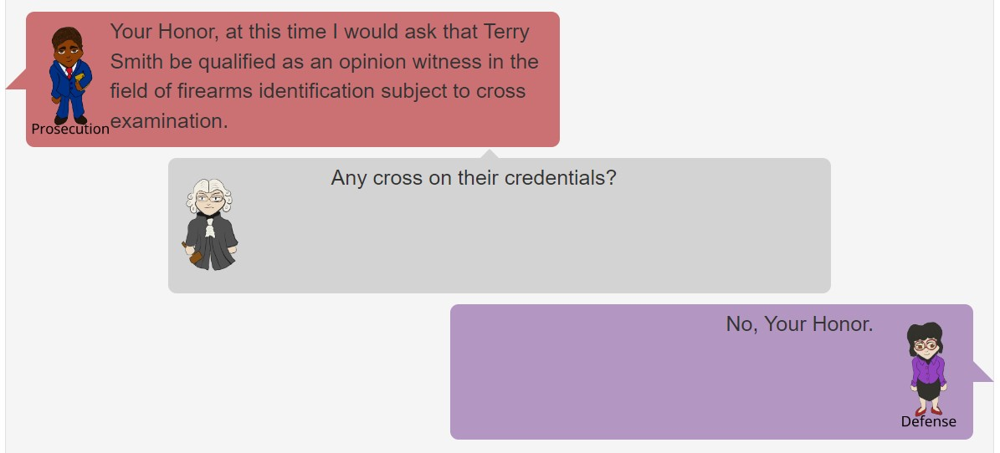

`r if(knitr:::is_latex_output()) '\\appendix'`

`r if(!knitr:::is_latex_output()) '# (APPENDIX) Appendix {-}'` 


# Testimony Transcripts

## Firearm Examiner

Q: Please state your name. 

A: John Smith

Q: Who do you work for? [@azvscelaya, 6-7]

A: The local police department

Q: What do you do for the police department? [@azvscelaya, 6-7]

A: I am a firearms examiner [@azvscelaya, 6-7]

Q: How long have you been doing that? [@azvscelaya, 6-7]

A: X amount of years

Q: What is a firearms examiner? [@azvscelaya, 6-7]

A: A firearms examiner is someone who looks at cartridge cases and bullets to determine whether they were fired in a particular firearm.

Q: What training is required to become a firearms examiner with the local police department? [@azvscelaya, 6-7]

A: I received my bachelor’s degree in forensic science and in X year I transferred to the crime lab from the crime scene unit. [@azvscelaya, 6-7] 
I underwent a two-year training program, which was supervised by experienced firearms examiners [@flvssheppard, 798-799]; 
I’ve toured manufacturing facilities and saw how firearms and ammunition were produced; and I’ve attended several national and regional meetings of firearms examiners.[@azvscelaya, 6-7]

Q: And during the course of your career, were you tested in proficiency to make sure.. you were still conducting appropriate examinations? [@flvssheppard, 798-799]

A: Yes. I have undergone annual proficiency examinations.[@flvssheppard, 798-799]

Q: Is the local police department lab accredited? [@azvscelaya, 6-7]

A: Yes, it is accredited by ASCLID/LAB [@azvscelaya, 6-7]

Q: And in addition to what you just told us, do you have other qualifications? [@ilvsbanks, 2]

A: Yes, I do.[@ilvsbanks, 2]

Q: Can you tell us what those are? [@ilvsbanks, 2]

A: Yes. I received training in the use of a bullet matching algorithm. 
This is an algorithm that evaluates the characteristics of two fired bullets, in order to produce a score for the similarity of the bullets, where more similar bullets are more likely to have been fired from the same gun. 
I attended a workshop on the algorithm on [DATE], held by CSAFE – Center for Statistics and Applications in Forensic Evidence. 
This involved use of the algorithm alongside my personal judgement. 
I found that my conclusion was reflected in the similarity score produced by the algorithm in all ## cases.

Q: Where does the bullet matching algorithm come from? [@mivsjohnson, 5]

A: It was created by _____. [@mivsjohnson, 5]

Q: How long has the state police been using the bullet matching algorithm? [@mivsjohnson, 5]

A: They have been using it since ###.

Q: Have you testified in court previously regarding the bullet matching algorithm? [@mivsjohnson, 5]

A: Yes, I have, approximately ## times. [@mivsjohnson, 5]

Q: Have you, as a firearms examiner, have you testified about opinions, given your opinion about the results of your testing? [@mivsjohnson, 5]

A: Yes, I have. [@mivsjohnson, 5]

Prosecution: Your Honor, at this time I would ask that XXX be qualified as an expert in the field of firearms identification subject to cross examination. [@ilvsbanks, 4]

Court: Any cross on their credentials? [@ilvsbanks, 4]

Defense: No, Your Honor [@ilvsbanks, 4]

Court: This witness is an expert in the area of firearms identification. 
They can testify to their opinions as well as facts. 
Go ahead.[@ilvsbanks, 4]

Q: What work did you do on this case? [@azvscelaya, 8]

A: I was asked to compare a bullet from the crime scene to a test fire from XX gun.[@azvscelaya, 8]

Q: Did you examine how many lands and grooves the bullet had? [@azvscelaya, 17-18]

A: Yes. [@azvscelaya, 17-18]

Q: Can you explain for the jury what that means? [@azvscelaya, 17-18]

A: Yes... In the interior of a barrel there are raised portions called lands and depressed areas called grooves. 
When a bullet passes down the barrel, a bullet will spin and that gives it stability and accuracy over a distance. 
Those raised areas are designed by the manufacturer. 
They’re cut into the barrel. 
And each particular file has a different combination of lands and grooves.
But essentially what those lands do will grip a bullet and spin it and as that bullet passes down the barrel, it scratches the random imperfections of that barrel into the bullet.[@azvscelaya, 17-18]

Q: Now, for these bullets, you counted up the lands and grooves and determined the direction of the twist, correct? [@azvscelaya, 17-18]

A: Yes. This bullet had six lands. And the interior of the barrel, the barrel will either twist right or it will twist left. 
And this particular case, the barrel twists right. 
And you can see that by looking at the bullet. 
If you look at the base of the bullet, either it goes to the left or goes to the right.[@azvscelaya, 17-18]

---Test-fired bullets admitted into evidence---

Q: Can you describe the process of obtaining these test-fired bullets?

A: The test-fired bullets came from a test fire of XX gun.

Q: You mentioned test firings, can you explain what that means? [@ilvsbanks, 6]

A: In test firing first what I would do is make sure the firearm is safe to actually test fire. 
Then I would use lab ammunition and I would test fire it, meaning that I’m creating a fired bullet. 
Typically you do two at a time. 
That way you have a fired bullet to compare to another fired bullet. [@ilvsbanks, 6]

Q: Would you then have taken the test firings you created and did you compare those test firings to the fired evidence that you had also received? [@ilvsbanks, 6]

A: Yes. First what I would do is compare my test shot to test shot.
I’m looking for a detailed microscopic pattern. 
Once I have done that then I would compare it to the fired evidence.[@ilvsbanks, 6]

Q: And how about the number of lands and direction of twist for the test fires? [@azvscelaya, 19-20]

A: It also had six lands, and twisted to the right [@azvscelaya, 19-20]

Q: Okay. Now, did you compare the test-fired bullets to the fired evidence under the comparison microscope? [@azvscelaya, 19-20]

A: Yes, I did. [@azvscelaya, 19-20]

Q: What is your conclusion? [@azvscelaya, 19-20]

A: I found that there were sufficient individualizing characteristics to conclude that the two bullets were fired from the same barrel. 

Q: How were you able to conclude that? [@azvscelaya, 19-20]

A: I placed them under the comparison microscope, and I roll the bullet around ‘til I can see the agreement in a particular area, unique surface contour that has sufficient agreement. 
At that point, when I’ve seen that, I start to rotate the bullets around and I look at all the different lands and grooves, impressions, for that unique detail. 
When I can see those, that agreement on multiple areas of the bullet, I identify the bullet as having sufficient agreement.[@azvscelaya, 19-20]

Q: Did you use an algorithm to compare these bullets as well?

A: Yes, I used the algorithm to compare the two test fires to each other. 
I also used the algorithm to compare the better-marking test fire to the fired evidence that I received.

Q: Could you explain how this algorithm compares bullets?

A: The algorithm uses 3D measurements to make a comparison between the surface contours of each of the lands on each bullet. 
These comparisons result in a match score between 0 and 1, where 1 indicates a clear match, and 0 indicates that there is not a match.
The bullet is aligned based on the maximum agreement between the lands, and the average match score for the lands is computed. 
This average score gives an overall match score for the entire bullet.

Q: What was the match score between the two test-fired bullets?

A: The match score was 0.9-.

Q: What was the match score between the better-marked test fire bullet and the fired evidence?

A: The match score was 0.XX.

Q: What does this match score indicate about the bullets?

A: The match score indicates that there is substantial similarity between the two bullets, which suggests that they were most likely fired from the same barrel.

Q: Now, how many times have you compared bullets to determine if they were fired from the same gun? [@azvscelaya, 19-20]

A: I’d say thousands. [@azvscelaya, 19-20]

Q: And do you ever see two bullets that have agreement in every area of the bullet? [@azvscelaya, 19-20]

A: No. 
The firing process of a firearm is dynamic, kind of like a contained explosion. 
When the firing pin hits the primer, which is basically the initiator, what gets it going, it will explode, bur the gun powder inside the casing, and the bullet will travel down the barrel, picking up the microscopic imperfections of the barrel, and the cartridge case will slam rearward against the support mechanism.
During that dynamic process, each time it happens, a bullet will be marked slightly differently from one to the next. [@azvscelaya, 19-20]

Q: When you reached a conclusion, did you write up a report? [@azvscelaya, 23]

A: Yes, I did. [@azvscelaya, 23]

Q: Is it the local police department’s protocol to have somebody else who’s a firearms tool mark examiner in your lab review that report, review your work, and determine if it’s correct? [@azvscelaya, 23]

A: Yes. [@azvscelaya, 23]

Q: That’s what we call peer review? [@azvscelaya, 23]

A: Peer review, yes. [@azvscelaya, 23]

Q: Thank you, no further questions. [@azvscelaya, 40]

--Cross examination—-

Q: Now, are you telling the jury today that in your opinion there’s only one gun in the entire world that could have produced the markings that you saw on these bullets? [@azvscelaya, 65]

A: I’m saying that the probability that the two markings were made by different sources is so small that it is negligible. [@dojcompare, 2] [@azvscelaya, 65]

Q: Exclusive to any other gun? [@azvscelaya, 65]

A: I obviously haven’t tested every other gun, but it is a practical impossibility. [@azvscelaya, 65]

Q: That’s your opinion. And your opinion, by the way, is subjective, right, and it’s based on your experience? [@azvscelaya, 72-73]

A: Based on my training and experience, yes. [@azvscelaya, 72-73]

Q: Is there something fixed about the amount of what has to be found to constitute sufficient agreement? [@usvsharris, 4459-4460]

A: No, there is not a fixed amount or a numerical value. [@usvsharris, 4459-4460]

Q: How long did you say you’ve been trained in the bullet matching algorithm? [@mivsjohnson, 19 - 21]

A: Since XXX [@mivsjohnson, 19 - 21]

Q: Okay. So that’s fairly new; is that fair to say? [@mivsjohnson, 19 - 21]

A: It is still fairly new, yes. [@mivsjohnson, 19 - 21]

Q: The software uses modeling; is that correct? [@mivsjohnson, 19 - 21]

A: Yes, it does. [@mivsjohnson, 19 - 21]

Q: You, personally, don’t know the source code; is that correct? [@mivsjohnson, 19 - 21]

A: That’s correct.[@mivsjohnson, 19 - 21]

Q: And, in fact, you, personally, would not be able to tell us the specific math that goes into this program; is that fair to say? [@mivsjohnson, 19 - 21]

A: We did receive training on what the math is doing. [@mivsjohnson, 19 - 21]


The Court: Terry Smith, the jury has asked me to forward this question to you. Answer if you're able.
To what percentage is the science accurate is the first question. And then I think the rest of that explanation of that question goes on to say, to determine that the bullets were fired from the same firearm, are you 100 percent sure? [@azvscelaya, 100 -101]

A: My opinion, I am 100 percent sure that these bullets were fired from this firearm. 
There is a published error rate for firearms examiners. 
The positive identification is less than two percent. 
I believe it's about 1.5 to 1.9. That's just a general number that's out there.[@azvscelaya, 100 -101]
The false negative identification rate is less than three percent. [@chumbley2021]

## Algorithm Expert
Inspired by @azvscelaya, @ilvsbanks, @mivsjohnson, @usvsharris, @flvssheppard, @hare2017automatic, @vanderplasComparisonThreeSimilarity2020, and @cyberposter. Should create citations by line as above.

Q: Please state your name.

A: Adrian/Avery Jones

Q: Who do you work for? [@azvscelaya, 6-7]

A: XXX place

Q: What is your current occupation?

A: XXX

Q: How long have you been doing that? [@azvscelaya, 6-7]

A: X amount of years

Q: What training is required to hold this occupation? [@azvscelaya, 6-7]

A: I have a Ph.D. in XX, and have spent X time developing the bullet matching algorithm algorithms. 
I have spent X years collaborating with firearms examiners during the development and rollout of this algorithm. 

Q: Are you familiar with the bullet matching algorithm?

A: Yes. I was involved in the development of the algorithm.

Prosecution: Your Honor, at this time I would ask that XXX be qualified as an expert in the bullet matching algorithm subject to cross examination.
Court: Any cross on their credentials? [@ilvsbanks, 4]

Defense: No, Your Honor [@ilvsbanks, 4]

Court: This witness is an expert in the area of the bullet matching algorithm. They can testify to their opinions as well as facts. [@ilvsbanks, 4]

Q: How many times have you testified regarding this bullet matching algorithm?

A: XX times.

Q: Could you describe how this bullet matching algorithm compares bullets?

A: Yes. For certain types of guns, the barrel will have lands and grooves, known as rifling. 
This rifling spins the bullet in order to make its trajectory more stable. Due to the manufacturing process, this rifling can produce identifiable markings on the bullet, based on random differences between barrels. 
Because of these random imperfections, the striation marks left on bullets can be compared in order to determine if it is likely that they were fired from the same gun. 

(Description based on @hare2017automatic)
The first step is to determine where the lands on the bullet are located. 
These lands will be the sunken area that contains the striation marks between the smoother grooves. 
3D scans are then taken for each land, and the ‘shoulders’, or area transitioning from the land to the groove, is excluded from the analysis.

Next, a stable area of the 3D scan containing the striations is selected, and a cross-section of this area is used to show the striations along with the topology of the region. 
A smoothing function is applied to remove some of the imaging noise from the 3D scan, leaving the striae intact. 
A second smooth is subtracted from the striations in order to remove the curvature of the region, leaving only the striae – this is what we call a signature. 
The signature for the two bullets being compared are aligned such that the best fit between the two signatures is achieved. 
The striation marks between the two signatures are then compared by evaluating how many of the high points and low points correspond. 
The algorithm can calculate the number of consecutively matching striations (CMS), or consecutively matching high points and low points – these are features used directly by some examiners to characterize the strength of a match. 
It also calculates the cross correlation between the two signatures, which is a numerical measure of the similarity between the two lands ranging between –1 and 1. 

These traits are combined using what is known as a random forest. 
Each forest is composed of decision trees, which use a subset of the observed values in order to make a decision about whether or not the bullets constitute a match. 
The other observations are held out in order to determine an error rate. 
When the random forest makes a prediction, each decision tree “votes”, producing a numerical value between 0 and 1 corresponding to the percentage of trees which evaluate the features as being sufficiently similar to have come from the same source. 

Q: Have you tested this algorithm?

A: Yes. 
This algorithm was tested and validated on a number of different test sets of bullet scans. 
It was found that, as long as there are sufficient marks on the bullet, the algorithm could successfully distinguish between bullets fired by the same gun and those fired from different guns. 
Examiners’ visual comparisons are also limited by the presence or absence of individualizing marks. 
Two test sets were using consecutively rifled barrels, which should be the most difficult to assess, and it was shown that the algorithm could distinguish between the bullets fired from two separate guns with complete accuracy. [@vanderplasComparisonThreeSimilarity2020]

Q: Can this algorithm be used on XX bullets fired from an XX firearm, such as the firearm in question for this case?
(Discussion of limitations [@mivsjohnson, 11])

A: Yes, this algorithm can be used on these types of bullets, given that this type of firearm marks well.

Q: Has this algorithm been published? (@cyberposter for importance of publication)

A: Yes. The algorithm and its process has been discussed in peer reviewed journals such as Law, Probability, and Risk, The Annals of Applied Statistics, and Forensic Science International. 
The algorithm is also open source, which means that the full source code, documentation, and numerical weights are available online for anyone to examine.


--Cross examination—-

Q: How long has the bullet matching algorithm been used in court cases? [@mivsjohnson, 19 - 21]

A: Since XXX

Q: Okay. So that’s fairly new; is that fair to say? [@mivsjohnson, 19 - 21]

A: It is still fairly new, yes. [@mivsjohnson, 19 - 21]

Q: This algorithm requires some decision making on the part of the operator, such as how much the signature is smoothed and what part of the bullets are inputted into the system, correct? (subjective aspects [@mivsjohnson, 21])

A: Yes, there are certain parameters which must be specified, but the system defaults are usually sufficient and have been validated with a number of different firearms and ammunition types. 
There are also operating protocols for determining which parts of the bullet are scanned, so while this process is manual, there are clear criteria and the associated variability from scanning is well understood, and published in Forensic Science International. 

Q: Can this algorithm be applied to all bullets? (gun specific/issues with damaged bullets)

A: No, the algorithm only works on traditionally rifled bullets which are largely undamaged. 
The algorithm has not been validated to work on seriously damaged or fragmented bullets.


# Study 2 Changes

## Cautions Against Expert Witnesses

### Jury Instructions

You have heard testimony from Terry Smith and Adrian Jones who have testified to opinions and the reasons for their opinions. This opinion testimony is allowed because of the education or experience of this witness. 
Such opinion testimony should be judged like any other testimony. 
You may accept or reject it, and give it as much weight as you think it deserves, considering the witness's education and experience, the reasons given for the opinion, and all the other evidence in the case. [@OpinionEvidence]

### Opinion Witness

@OpinionEvidence suggests that witnesses should not be qualified as experts, as it may cause the jury to place undue weight in their testimony. Instead, @PROPOSALSELIMINATEPREJUDICIAL implements the term "opinion witness" in the place of "expert witness". This practice has been adopted in our revised testimony, when qualifying the witness based on experience and education.

### Cross Examination

The strength of evidence ("the probability that the two markings were made by different sources is so small that it is negligible") was moved from the cross examination to the direct examination, since this strength of evidnece should be introduced by the prosecution. Additional testimony regarding subjectivity was added to the cross examination as well, from [@usvsharris, 54]:

Q: You have a criterion in you head, a subjective criterion, of what will constitute an identification. Is that correct?

A: Yes.

Q: All right. If we brought three more people in, would their subjective criterion in their head be identical to yours?

A: They would look for that same sufficient agreement. However, based on their training and experience on difficult comparisons, they may or may not come to the same decision.

Q: Right. But they also could reach the same decision but have a different subjective criterion than you. Is that fair?

A: They may, possibly. I don't know. I can't speak for other examiners.

Additional testimony was also added to address the distinction between evidence that the gun was at the crime scene, and evidence that Cole was at the crime scene [@flvssheppard, 831]:

Q: You can't tell us anything about who shot the firearm, correct?

A: That is correct.

## Clarifying Sides

To make sure individuals are clear on who the firearms examiner is testifying for, testimony was added related to the calling and the swearing in of the witness. The testimony below is from @mivsjohnson.

Court: Your next witness, please.

Prosecution: The People would call John Smith.

Court: Hello.

Smith: Hi

Court: Would you raise your right hand for me? Do you sear the testimony you're about to give will be the truth, the whole truth, nothing but the truth, under penalty of perjury?

Smith: I do.

Court: Please be seated. State your full name for the record and spell your last name.

Witness: My name in John Smith, last name S-m-i-t-h

## Images

In order to clarify the speakers in the testimony and create a more engaging environment, we implemented character drawings (by Richy Meleus) to represent various actors that may be present in the courtroom. These characters' faces and clothing are largely exchangeable, allowing for a large combination of clothing and characteristics.

```{r demo_evidence, echo=FALSE, warning=FALSE}
library(gridExtra)
library(grid)
library(jpeg)

judge <- readJPEG("images/Judge.jpg")

forensic_science <- readJPEG("images/Forensic Scientist.jpg")

lawyer <- readJPEG("images/Lawyer.jpg")

analyst <- readJPEG("images/Analyst.jpg")

defendant <- readJPEG("images/Defendant.jpg")

hazmat <- readJPEG("images/Hazmat worker.jpg")
police <- readJPEG("images/Police Officer.jpg")

inmate <- readJPEG("images/Inmate.jpg")

grid.arrange(rasterGrob(judge),rasterGrob(forensic_science),rasterGrob(lawyer),
             rasterGrob(analyst),rasterGrob(defendant),rasterGrob(hazmat),
             rasterGrob(police),rasterGrob(inmate),
             nrow=2, ncol=4)
```

```{r jury, echo=FALSE, warning=FALSE}

include_graphics("images/Jury.jpg")
```

These images were placed in their respective speech bubbles in order to indicate the speaker, with color coding to indicate which side witnesses were testifying for: the prosecution's side had warmer colors, the defense had cooler colors, and the judge was a neutral grey. 

```{r screenshots, echo=FALSE, warning=FALSE}

include_graphics("images/Study2_Screenshot.jpg")


```


# Select Comments

## Initial Study

"Even if it seems like Richard Cole's gun is the same gun fired in the store, there is not enough (or any) evidence that Richard Cole was the one to fire the gun, so he cannot reasonably be convicted." 

"The 1.5% error rate does seem sort of high, but at the same time it seems extremely unlikely that two guns that leave such similar bullet markings would be found in the general area of the crime."

"Very difficult for juror to understand and remember the scientific evidence."

"I'm not sure why the prosecution would have even called that witness because they basically said there was no conclusive bullet evidence"

"I think it's interesting there is not any evidence identifying the suspect from the witness or cameras. Makes it hard to make an accurate judgement, especially when the gun was obtained through a routine violation."

"I'm wondering why testimony had to discuss details of the ML algorithm?  When they use a microscope to examine evidence, does the examiner have to explain the optics of microscopes?"

"It seems likely that it was the gun but I'd love to have a witness who was skeptical of this stuff. But even if it's the gun, no evidence it was defendent who used it.  I'm worried this is junk science but I don't know enough to ahve more than a lingering doubt."

"Firearm evidence seems a lot like hair evidence which was debunked but I don't know that to be fact. From what was stated in this testimony, it seems to be mostly reliable but I wouldn't say it is strongly scientific."

"Was interesting.  I was very surprised that with today's technology, a fired bullet could still be labeled inconclusive."

"Richard Cole has been victimized by the court system in this case. The seizure of his firearm - absent any other evidence - was most probably illegal. Police cannot be allowed to simply confiscate every legally owned gun they come across in case it was used to commit a crime."

"I would trust the trained professional human with experience who can use an algorithm as an extra tool over an algorithm alone any day."

"The examiner themself said it was inconclusive if it was the same gun. Do I think Richard did it? Yes, he probably did but I need more evidence before I risk sending a innocent man to jail."

"Random forest methods for machine learning and classification are not very robust.  They identify pictures of cats as hamburgers, for example.  Just use science."

"I would liked to have had the score given by the algorithm for the comparison between the evidential bullet and the weaker of the two firing bullets.  I would also like information on how well the comparison judges between multiple guns of the same make, multiple guns of the same caliber of different manufacturers, and of situations where the algorithm is misfed information regarding bullet information such as comparisons between bullets of different sizes.  From the given testimony, it is difficult to judge if the information around the algorithm that is public was entered into evidence, and whether that information contained the issues I question.  Of course, if I were on the jury for this case, I would also want to know why the detective was searching the car for a traffic stop."

"Just that a number of forensic sciences are anything but science, such as finger-printing, hair and fiber analysis, and bullet striation analysis."

"I'm an attorney, don't know if that makes a difference. I had 4th amendment concerns about the seizing of the gun in the first place :) - from my understanding, neither the human nor machine left very persuasive indicators that the gun was the same in my view. "

"I am cautious when it comes to algorithms because it seems as they can be problematic and subject to errors.  Also it may have been his gun but they couldn't prove that he was the one using it at that time"

"The information from the Algorithm expert was not easy to digest."

"The details of the methodology were difficult to understand, but the basic ideas were clear and credible."

"I was, actually, fairly engaged with this!  I also appreciate, you focused this study on the evidence / expert testimony, and not on the usual, played out "stereotyping the alleged" trope.  Though I can't lay claim to a perfect understanding of all the science, etc., I still do appreciate your having enough respect for me as a participant to lay it on me anyway.  Both witnesses kept it fairly layman, honestly.  I am more surprised, you didn't use this opportunity to hit me with some super-complex questions.  (Which would've irritated me, mind you.)  Firearm evidence is *pretty* good, but not perfect.  I might've selected "extremely reliable" instead of "moderately reliable," if you had presented me an option to select "perfectly reliable" there.  (Ha ha ha.)"

"the algorithm experts testimony was mostly over my head. I didn't try very hard to understand it. I just accepted it."

"Not about the study itself, but I have seen several articles (I don't recall the sources but thought they were credible) calling into question this type of evidence.  The main thrust was that it is unreliable and often not objective.  This information undoubtedly shaded my responses to this survey."

"I have questions about the initial search, and you may wish to adjust the statement that a police officer pulled a car over for speeding and the detective was present and searched the car. I don't think the search was supported unless the gun was in plain view or the suspect gave permission. I also don't believe this case would have come to court given the state of the evidence. It is remotely possible that Cole was guilty and used a different handgun at the scene, but there was no evidence to support this."

"I am not a firearm expert, so some of the information that the examiner gave almost sounded like a foreign language to me. I honed on the fact that he said that his findings were inconclusive, and that it appeared that the defendant was charged because they found him with an extremely common firearm in his vehicle. I could not vote to convict the defendant. "

"I would like to have known why the case was brouth given the evidence and if there was another evidentiary component."

"I don't know that much about court stuff, but why would the prosucution bring the firearms expert when he didn't think the defendant's gun fired the shot? I was confused about that."

"None too particular! I definitely would be weirded out as a juror if the expert said "it's inconclusive" and neither the prosecution nor the defense explored that further, based purely on court TV and whatever.  Also, the longer I think about it, the less I believe in the expert testimony; we were never given a "how similar are two random guns' lands and grooves" figure, yet we kind of assumed there was a uniqueness without Terry/Alex Smith telling us that. I definitely would've fallen into that fallacy in the moment."

"I did not see any mention of the possibility of someone else firing the gun.  I was wondering about that."

"I think the firearm evidence is fairly scientific, but it's certainly not failproof. While the error rate is stated to be very low, the fact that the process is subjective means that the error rate itself is subjective and makes me doubt how reliable that evidence actually is. If there is no other evidence pointing to the defendant, I wouldn't be able to find him guilty based on the gun alone. "

"Thank you for conducting this study. Where's the defense in all of this? It would have been  helpful to know whether or not the defendant had an alibi, whether his firearm had in fact been recently fired, from a forensics perspective, whether there were any in-store or exterior or neighborhood cameras that picked up whoever discharged the firearm. Convenience stores nearly always have a height chart posted alongside the door but no one provided an approximate height or weight for the person who discharged the firearm. This was an interesting study. All the best to your research team in this and  your future endeavors. "

"The evidence made me think it highly likely that Smith had the gun and was guilty. It was too much of a coincidence, for the evidence not to be accurate. However I also felt that their was at least a 5 percent to 15 percent chance that he was innocent. Even though I thought the evidence was right, I found it emotionally hard to be 100 percent certain."

"yes. I am focused on the fact that the officers did not have probable cause to confiscate the weapon and the evidence was obtained illegally and should be excluded. It is irrelevant that he was actually guilty, His rights were violated and they evidence should be excluded and the case dismissed."

"It would be interesting to know if the prosecution would order a second testing of the gun with a different expert. Also why would the prosecution charge this man since it had no eyewitnesses or other evidence placing him at the scene of the robbery at the time of the robbery and since the gun found in the defendant was not a match to the bullet found at the scene. Charging him seems pointless as there's virtually no evidence other than he owned a 9mm handgun."

"I would have like another firearms expert testify or a representative from that 9mm handgun manufacturer explain how and why each individual handgun are designed such that the lands and grooves create unique impressions on bullets for each gun. I do believe the firearms expert and his credibility. Further, the defendant would be basically convicted only on one evidence. Would have liked to read or know what was his alibi during that attempted robbery and if a search warrant issued to search for that ski mask. What about security cameras to determine any other physical identification. This case presentation was scant and focused too heavily on one piece of evidence and testimony. "

"Just from TV, I thought the fired bullet comparisons were more scientific, like 100 percent accuracy, not a subjective determination."

"Years ago, I wouldn't have felt this way but now the science and technology used is far superior."

"I'd prefer more information about the clerk's perception of the thief's size and build to see if it matches.  Also does the defendant have any explanation to offer like someone else had his car, may have had his gun at this time? Where does he say he was at the time of the crime?  Was there video of the thief driving away and if so was it apparently the same car?  The is a 1 in 50 chance the firearms expert made an error, so I would really like more corroborating background before saying there is no reasonable doubt..  "

"Going by what I read and reviewing my notes I see that the firearms evidence was inconclusive against R. Cole.  So I am baffled as to why he was convicted.  Also I prefer more things like visual evidence via a good quality video camera. Or a whole group of people testifying against someone saying things like they saw, they heard, or they know someone is prone to commit certain crimes."

## Response Type Survey

"Seems highly unlikely that the DA would take this case to trial with ZERO eyewitness identification, the gun seized was NOT the gun that was used in the robbery, and the traffic stop has some constitutional issues." - Elimination

"There were issues with the way the study is pesented with regards to guilt.  The evidence never established that the gun was owned or used by the defendent and the search of the car was warrantless and without cause.  while the forensic eveidence may establish probabliilty that the gun was used in the crime it did not establish a connection to the defndent." - Identification

"It seems to be a study about racial bias, but I don't know. Thank you foe allowing my paeticipating." - Elimination

"Was fun! I liked learning about the forensics used in firearm examination. Though it is a bit worrying there's no real  scale for "Sufficient agreement". Although it's logical that grooves and twists in the firearm would leave a marking on the bullet, I did not think such differences were sufficient to tell one firearm of the same manufacturer from the other. Now I do (until any other evidence proves otherwise)" - Elimination

"your questions about percentage of his guilt were not clear....it should have said "found guilty" or I believe he is guilty. Difference.  I believe he's guilty but based on the evidence, should not be found guilty." - Elimination

"The visuals of the conversation really helped me to focus in on the study. Also GREAT idea with the notepad, i tend to forget important information when im overloaded and it helps to be able to jot things down. Thanks for the study, good luck with your research!" - Identification

"I enjoyed doing the study and thinking about the evidence presented. The method of presenting the evidence was new and it was a good idea to provide a way to take notes because i paid more attention." - Identification

"Not really. You didn't show enough of the case. If the prosecution was showing it was false, he was  confirming it wasn't the defendant, so he must have had more evidence like fingerprints that got him on the scene." - Elimination

"This was a very interesting study to take. I liked the graphics and I liked how the study moved forward easily and I understood everything asked of me. I had no problems taking the study and I really enjoyed taking this study." - Identification

"It was pretty obvious that he is guilty. " - Identification

"Without any fingerprint evidence or other information (alibi, motive, etc.), I would be hard pressed to find him guilty.  Thanks, this was a fun study to take!" - Identification

"The testimony by the firearms expert was convincing. The evidence has shown that the defendant is guilty beyond a reasonable doubt." - Identification

"It's interesting as all we are given is the testimony of a single expert who is very certain of their work. Even sharing that the margin of error was very low, they expressed enough competence and confidence in their work that they seemed accurate. They did an excellent job explaining their work. Ideally a case would have more evidence that could sway one way or another, but with the information we had it seemed quite conclusive." - Identification

"No. It was pretty detailed and technical, but fairly easy to follow when you pay close attention." - Elimination

"I like the section on taking notes--it slows the study down but makes it more accurate" - Identification

"While an almost certain identification of the bullet being fired from the same gun is damaging, there isn't enough proof that it was this individual who robbed the store. One basic thing I'd like to know is how tall the witness would estimate the attempted robber as and how tall the defendant is. If he is significantly taller or shorter then it would be fair to dismiss him as the suspect. Is there any evidence that he is missing a single round of ammunition? Could it be determined that his gun was fired or cleaned recently, prior to the test firing? Does anybody else have access to his firearm or know where he keeps it? There are a lot of additional variables here. " - Identification

"were you trying to trick the reader? the firearms ex. said that the gun did not match." - Elimination

"The display was uncomfortable. I had to keep enlarging, then reducing the screen size even though I had a 24 inch screen." - Identification

"This is tough, more evidence is needed.  Did Cole have access to a different 9mm firearm?  Was the negative conclusion indeed fasle?  If it was the firearm involved in the shooting ,was it actually Cole who fired it?  Stopping and random guy for speeding and finding a firearm, does not a criminal make." - Elimination

"The defense was not very good, so I think he has a good chance at a new trial." - Identification

"I like the graphics that help to create the feeling of a court of examination." - Identification

"This scenario was odd, in that it focused on bullet matching but asked about whether or not the defendant fired \*any\* gun at the scene of the crime. I saw no evidence presented to that effect" - Elimination

"he sounded guilty until the expert weighed in, then expert testimony completely changed my mind to not guilty" - Elimination

"I don't feel like 1 single expert witness that works for the police is enough evidence. I believe the examiner would have found the ammo matched no matter what just to get a guilty verdict. It needed to be examined by more experts. This alone was not nearly enough evidence to convict." - Identification

"why  ask the same question over and over again?." - Identification

"Recently I have seen an article about a court decision that testimony about fired bullet comparisons have been shown to be unreliable.  At least some convictions in that state based upon fired bullet comparisons have been overturned.  I did not use that information in this case." - Elimination

"Good idea having a note pad area; haven't seen that before." - Identification

"The cartoon presentation of the testimony was childish. And where is any testimony about the defendant's guilty, i.e., alibi, alibi witnesses, etc." - Identification
